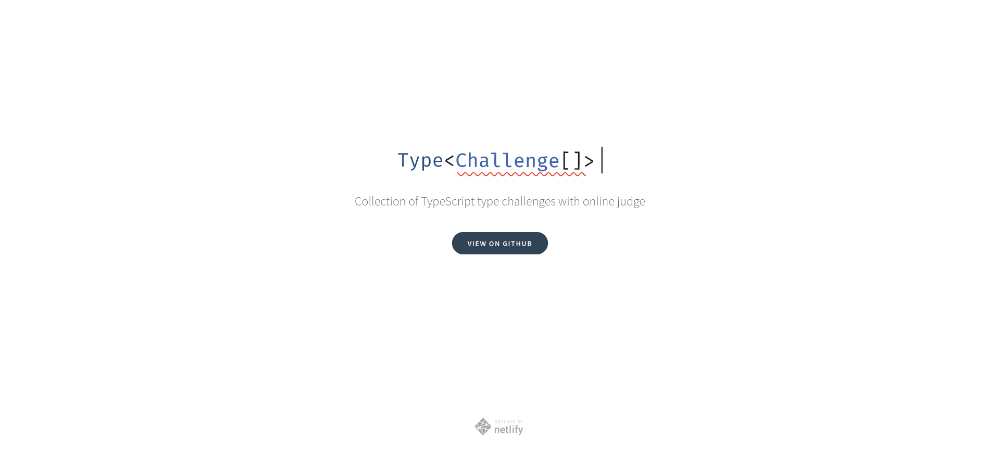
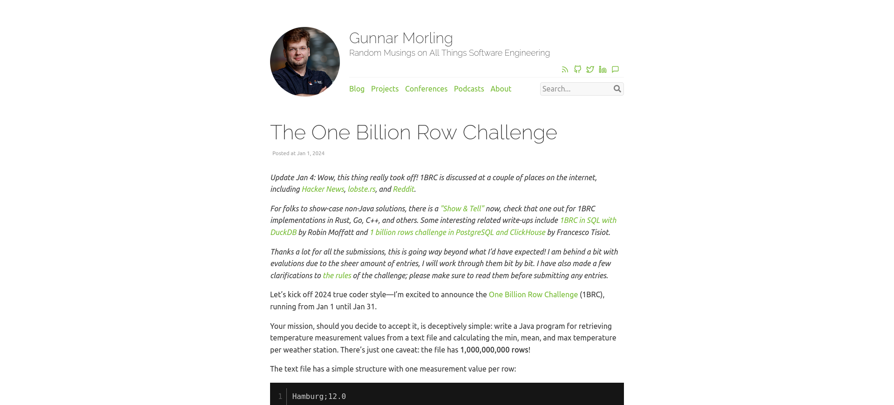

# Tools Library

Constitution d'une liste d'outils, répos, d'idées d'apps, challanges ou tout autre ressource pour s'améliorer en programmation peux importe son niveau

> C'est publique et ouvert à tous donc n'hésitez pas à faire une MR si vous avez d'autre sites de veille, outils, idées d'apps de tout niveau, liens de tutos d'outils à dev sois même dans différents languages, ou même des liens vers des challanges de prog peux importe le langage, ça interessera toujours des quelqu'un, si bien évidement ils ne sont pas déja présent ici 😉

## Contributeurs

## [App Ideas (florinpop17/app-ideas)](https://github.com/florinpop17/app-ideas/)

| Niveau                       | Profile développeur                                                                                                                                                                                     |
|------------------------------|---------------------------------------------------------------------------------------------------------------------------------------------------------------------------------------------------------|
| 1 | Développeurs aux premiers stades de leur parcours d’apprentissage. Ceux qui se concentrent généralement sur la création d’applications destinées aux utilisateurs.                                      |
| 2 | Développeurs à un stade intermédiaire d’apprentissage et d’expérience. Ils sont à l’aise avec l’UI/UX, utilisent des outils de développement et créent des applications qui utilisent les services API. |
| 3 | Développeurs qui possèdent tout ce qui précède et apprennent des techniques plus avancées telles que la mise en œuvre d'applications backend et de services de base de données.                         |

### [Niveau 1 - Projets de niveau débutant](#niveau-1)

<!-- Non traduit -->
<!-- [...document.querySelector('.markdown-heading + table:nth-of-type(4) tbody').querySelectorAll('tr')].map(e => `| [${e.querySelector('a').innerText}](${window.location.href}${e.querySelector('a').getAttribute('href')}) | ${e.querySelectorAll('td')[1].innerText} |`).join("\n") -->

<!-- Traduit -->
<!-- [...document.querySelector('.markdown-heading + table:nth-of-type(2) tbody').querySelectorAll('tr')].map(e => `| [${e.querySelector('a').innerText}](${window.location.href.replace('github-com.translate.goog', 'github.com').replace('/?_x_tr_sl=auto&_x_tr_tl=fr&_x_tr_hl=fr', '')}${e.querySelector('a').getAttribute('href').replace('/florinpop17/app-ideas', '')}) | ${e.querySelectorAll('td')[1].innerText} |`).join("\n") -->

| Nom de projet                                                                                                                             | Courte déscription                                                                |
|-------------------------------------------------------------------------------------------------------------------------------------------|-----------------------------------------------------------------------------------|
| [Bin2Dec](https://github.com/florinpop17/app-ideas/blob/master/Projects/1-Beginner/Bin2Dec-App.md)                                        | Convertisseur de nombres binaires en décimaux                                     |
| [Aperçu du rayon de bordure](https://github.com/florinpop17/app-ideas/blob/master/Projects/1-Beginner/Border-Radius-Previewer.md)         | Aperçu de la façon dont les valeurs de rayon de bordure CSS3 affectent un élément |
| [Calculatrice](https://github.com/florinpop17/app-ideas/blob/master/Projects/1-Beginner/Calculator-App.md)                                | Calculatrice                                                                      |
| [Lumières de Noël](https://github.com/florinpop17/app-ideas/blob/master/Projects/1-Beginner/Christmas-Lights-App.md)                      | Simulez une chaîne de lumières de Noël                                            |
| [Application Cause Effet](https://github.com/florinpop17/app-ideas/blob/master/Projects/1-Beginner/Cause-Effect-App.md)                   | Cliquez sur l'élément de la liste pour afficher les détails de l'élément          |
| [Cycle de couleurs](https://github.com/florinpop17/app-ideas/blob/master/Projects/1-Beginner/Color-Cycle-App.md)                          | Faire défiler une valeur de couleur à travers des changements incrémentiels       |
| [Compte à rebours](https://github.com/florinpop17/app-ideas/blob/master/Projects/1-Beginner/Countdown-Timer-App.md)                       | Compte à rebours d'événement                                                      |
| [Application CSV2JSON](https://github.com/florinpop17/app-ideas/blob/master/Projects/1-Beginner/CSV2JSON-App.md)                          | Convertisseur CSV en JSON                                                         |
| [Dollars en Cents](https://github.com/florinpop17/app-ideas/blob/master/Projects/1-Beginner/Dollars-To-Cents-App.md)                      | Convertir des dollars en centimes                                                 |
| [Variables CSS dynamiques](https://github.com/florinpop17/app-ideas/blob/master/Projects/1-Beginner/Dynamic-CSSVar-app.md)                | Modifier dynamiquement les paramètres des variables CSS                           |
| [Première application de base de données](https://github.com/florinpop17/app-ideas/blob/master/Projects/1-Beginner/First-DB-App.md)       | Votre première application de base de données !                                   |
| [Retourner l'image](https://github.com/florinpop17/app-ideas/blob/master/Projects/1-Beginner/Flip-Image-App.md)                           | Changer l'orientation des images sur deux axes                                    |
| [Statut GitHub](https://github.com/florinpop17/app-ideas/blob/master/Projects/1-Beginner/GitHub-Status-App.md)                            | Afficher l'état actuel de GitHub                                                  |
| [Bonjour](https://github.com/florinpop17/app-ideas/blob/master/Projects/1-Beginner/Hello-App.md)                                          | Message d'accueil dans la langue maternelle de l'utilisateur                      |
| [Simulateur de boîte aux lettres IOT](https://github.com/florinpop17/app-ideas/blob/master/Projects/1-Beginner/IOT-Mailbox-App.md)        | Utilisez les rappels pour vérifier votre courrier postal                          |
| [Validation des entrées JS](https://github.com/florinpop17/app-ideas/blob/master/Projects/1-Beginner/Javascript-Validation-With-Regex.md) | Script pour valider les entrées saisies par un utilisateur à l'aide de RegEx      |
| [Application JSON2CSV](https://github.com/florinpop17/app-ideas/blob/master/Projects/1-Beginner/JSON2CSV-App.md)                          | Convertisseur JSON en CSV                                                         |
| [Valeur clé](https://github.com/florinpop17/app-ideas/blob/master/Projects/1-Beginner/Key-Value-App.md)                                   | Valeurs des événements du clavier                                                 |
| [Générateur Lorem Ipsum](https://github.com/florinpop17/app-ideas/blob/master/Projects/1-Beginner/Lorem-Ipsum-Generator.md)               | Générer un texte d'espace réservé Lorem ipsum                                     |
| [Application Notes](https://github.com/florinpop17/app-ideas/blob/master/Projects/1-Beginner/Notes-App.md)                                | Créer un bloc-notes en ligne                                                      |
| [Régression de Pearson](https://github.com/florinpop17/app-ideas/blob/master/Projects/1-Beginner/Pearson-Regression-App.md)               | Calculer le coefficient de corrélation pour deux ensembles de données             |
| [Horloge Pomodoro](https://github.com/florinpop17/app-ideas/blob/master/Projects/1-Beginner/Pomodoro-Clock.md)                            | Minuterie de tâches pour améliorer la productivité personnelle                    |
| [Page de destination du produit](https://github.com/florinpop17/app-ideas/blob/master/Projects/1-Beginner/Product-Landing-Page.md)        | Présenter les détails du produit aux acheteurs potentiels                         |
| [Application de quiz](https://github.com/florinpop17/app-ideas/blob/master/Projects/1-Beginner/Quiz-App.md)                               | Testez vos connaissances en répondant aux questions                               |
| [Application de recettes](https://github.com/florinpop17/app-ideas/blob/master/Projects/1-Beginner/Recipe-App.md)                         | Recette                                                                           |
| [Générateur de repas aléatoires](https://github.com/florinpop17/app-ideas/blob/master/Projects/1-Beginner/Random-Meal-Generator.md)       | Générer des repas aléatoires                                                      |
| [Générateur de nombres aléatoires](https://github.com/florinpop17/app-ideas/blob/master/Projects/1-Beginner/Random-Number-Generator.md)   | Générez un nombre aléatoire entre les plages.                                     |
| [Convertisseur romain en décimal](https://github.com/florinpop17/app-ideas/blob/master/Projects/1-Beginner/Roman-to-Decimal-Converter.md) | Convertir des nombres romains en nombres décimaux                                 |
| [Conception du curseur](https://github.com/florinpop17/app-ideas/blob/master/Projects/1-Beginner/Slider-Design.md)                        | Afficher des images à l'aide d'un curseur                                         |
| [Application Chronomètre](https://github.com/florinpop17/app-ideas/blob/master/Projects/1-Beginner/Stopwatch-App.md)                      | Compter le temps consacré aux activités                                           |
| [Vrai ou faux](https://github.com/florinpop17/app-ideas/blob/master/Projects/1-Beginner/True-or-False-App.md)                             | Identifier le résultat d'une comparaison conditionnelle                           |
| [Chiffre de Vigenère](https://github.com/florinpop17/app-ideas/blob/master/Projects/1-Beginner/Vigenere-Cipher.md)                        | Chiffrer le texte à l'aide du chiffre Vigenere                                    |
| [Refroidissement éolien](https://github.com/florinpop17/app-ideas/blob/master/Projects/1-Beginner/Windchill-App.md)                       | Calculer le facteur de refroidissement éolien à partir d'une température réelle   |
| [Fréquence des mots](https://github.com/florinpop17/app-ideas/blob/master/Projects/1-Beginner/Word-Frequency-App.md)                      | Calculer la fréquence des mots dans un bloc de texte                              |
| [Application météo](https://github.com/florinpop17/app-ideas/blob/master/Projects/1-Beginner/Weather-App.md)                              | Obtenez la température et les conditions météorologiques d'une ville.             |

### [Niveau 2 - Projets de niveau intermédière](#niveau-2)

| Nom de projet                                                                                                                                               | Courte déscription                                                   |
|-------------------------------------------------------------------------------------------------------------------------------------------------------------|----------------------------------------------------------------------|
| [Masques de bits](https://github.com/florinpop17/app-ideas/blob/master/Projects/2-Intermediate/Bit-Masks-App.md)                                            | Utilisation de masques de bits pour les conditions                   |
| [Application de recherche de livres](https://github.com/florinpop17/app-ideas/blob/master/Projects/2-Intermediate/Book-Finder-App.md)                       | Rechercher des livres selon plusieurs critères                       |
| [Calculatrice CLI](https://github.com/florinpop17/app-ideas/blob/master/Projects/2-Intermediate/Calculator-CLI.md)                                          | Créez une calculatrice de base cli.                                  |
| [Jeu de mémoire de cartes](https://github.com/florinpop17/app-ideas/blob/master/Projects/2-Intermediate/Card-Memory-Game.md)                                | Mémorisez et faites correspondre les images cachées                  |
| [Application de recherche d'organismes de bienfaisance](https://github.com/florinpop17/app-ideas/blob/master/Projects/2-Intermediate/Charity-Finder-App.md) | Trouvez une organisation caritative mondiale à laquelle faire un don |
| [Extension du thème Chrome](https://github.com/florinpop17/app-ideas/blob/master/Projects/2-Intermediate/Chrome-Theme-Extension.md)                         | Créez votre propre extension de thème Chrome.                        |
| [Convertisseur de devises](https://github.com/florinpop17/app-ideas/blob/master/Projects/2-Intermediate/Currency-Converter.md)                              | Convertissez une devise en une autre.                                |
| [Application de dessin](https://github.com/florinpop17/app-ideas/blob/master/Projects/2-Intermediate/Drawing-App.md)                                        | Créer des œuvres d'art numériques sur le Web                         |
| [Application de traduction Emoji](https://github.com/florinpop17/app-ideas/blob/master/Projects/2-Intermediate/Emoji-Translator-App.md)                     | Traduire des phrases en Emoji                                        |
| [Application Flashcards](https://github.com/florinpop17/app-ideas/blob/master/Projects/2-Intermediate/FlashCards-App.md)                                    | Révisez et testez vos connaissances grâce aux Flash Cards            |
| [Application Flip Art](https://github.com/florinpop17/app-ideas/blob/master/Projects/2-Intermediate/Flip-Art-App.md)                                        | Animer un ensemble d'images                                          |
| [Application de suggestion de jeux](https://github.com/florinpop17/app-ideas/blob/master/Projects/2-Intermediate/Game-Suggestion-App.md)                    | Créez des sondages pour décider à quels jeux jouer                   |
| [Profils GitHub](https://github.com/florinpop17/app-ideas/blob/master/Projects/2-Intermediate/GitHub-Profiles.md)                                           | Une application de recherche d'utilisateurs GitHub                   |
| [Jeu HighStriker](https://github.com/florinpop17/app-ideas/blob/master/Projects/2-Intermediate/HighStriker-Game.md)                                         | Jeu de carnaval d'homme fort Highstriker                             |
| [Scanner d'images](https://github.com/florinpop17/app-ideas/blob/master/Projects/2-Intermediate/Image-Scaner.md)                                            | Application de numérisation d'images                                 |
| [Aperçu de démarque](https://github.com/florinpop17/app-ideas/blob/master/Projects/2-Intermediate/Markdown-Previewer.md)                                    | Aperçu du texte formaté dans le markdown aromatisé GitHub            |
| [Générateur de tableaux de démarques](https://github.com/florinpop17/app-ideas/blob/master/Projects/2-Intermediate/Markdown-Table-Generator.md)             | Convertir un tableau en texte au format Markdown                     |
| [Éditeur mathématique](https://github.com/florinpop17/app-ideas/blob/master/Projects/2-Intermediate/math-editor.md)                                         | Un éditeur mathématique que les étudiants peuvent utiliser           |
| [Application Générateur de mèmes](https://github.com/florinpop17/app-ideas/blob/master/Projects/2-Intermediate/Meme-Generator-App.md)                       | Créer des mèmes personnalisés                                        |
| [Génération de noms à l'aide de RNN](https://github.com/florinpop17/app-ideas/blob/master/Projects/2-Intermediate/Name-Generator.md)                        | Générer des noms à l'aide de l'ensemble de données de noms           |
| [Générateur de mot de passe](https://github.com/florinpop17/app-ideas/blob/master/Projects/2-Intermediate/Password-Generator.md)                            | Générer des mots de passe aléatoires                                 |
| [Répertoire des podcasts](https://github.com/florinpop17/app-ideas/blob/master/Projects/2-Intermediate/Podcast-Directory-App.md)                            | Répertoire des podcasts préférés                                     |
| [Générateur de badges QR Code](https://github.com/florinpop17/app-ideas/blob/master/Projects/2-Intermediate/QRCode-Badge-App.md)                            | Encoder les informations du badge dans un QRcode                     |
| [Assistant d'expression régulière](https://github.com/florinpop17/app-ideas/blob/master/Projects/2-Intermediate/RegExp-Helper-App.md)                       | Tester les expressions régulières                                    |
| [Application de reçus de vente](https://github.com/florinpop17/app-ideas/blob/master/Projects/2-Intermediate/Sales-DB-App.md)                               | Enregistrer les reçus de vente dans une base de données              |
| [Boutique en ligne simple](https://github.com/florinpop17/app-ideas/blob/master/Projects/2-Intermediate/Simple-Online-Store.md)                             | Boutique en ligne simple                                             |
| [Générateur de supports sportifs](https://github.com/florinpop17/app-ideas/blob/master/Projects/2-Intermediate/Sports-Bracket-Generator.md)                 | Générer un diagramme de support sportif                              |
| [Art à cordes](https://github.com/florinpop17/app-ideas/blob/master/Projects/2-Intermediate/String-Art.md)                                                  | Une animation de chaînes colorées en mouvement                       |
| [Ceci ou ce jeu](https://github.com/florinpop17/app-ideas/blob/master/Projects/2-Intermediate/This-or-That-Game.md)                                         | Ceci ou ce jeu                                                       |
| [Fuseau horaire](https://github.com/florinpop17/app-ideas/blob/master/Projects/2-Intermediate/Timezone-Slackbot.md)                                         | Afficher les fuseaux horaires des équipes                            |
| [Application de tâches](https://github.com/florinpop17/app-ideas/blob/master/Projects/2-Intermediate/To-Do-App.md)                                          | Gérer les tâches personnelles                                        |
| [Pratique de frappe](https://github.com/florinpop17/app-ideas/blob/master/Projects/2-Intermediate/Typing-Practice-App.md)                                   | Pratique de frappe                                                   |
| [Application de vote](https://github.com/florinpop17/app-ideas/blob/master/Projects/2-Intermediate/Voting-App.md)                                           | Application de vote                                                  |

### [Niveau 3 - Projets de niveau avancé](#niveau-3)

| Nom de projet                                                                                                                                  | Courte déscription                                                                           |
|------------------------------------------------------------------------------------------------------------------------------------------------|----------------------------------------------------------------------------------------------|
| [Bot cuirassé](https://github.com/florinpop17/app-ideas/blob/master/Projects/3-Advanced/Battleship-Bot.md)                                     | Créez un bot Discord qui joue à Battleship                                                   |
| [Moteur de jeu de cuirassé](https://github.com/florinpop17/app-ideas/blob/master/Projects/3-Advanced/Battleship-Game-Engine.md)                | Créez un moteur appelable pour jouer au jeu Battleship                                       |
| [Jeu Boole Bots](https://github.com/florinpop17/app-ideas/blob/master/Projects/3-Advanced/Boole-Bot-Game.md)                                   | Combattre des robots pilotés par l'algèbre booléenne                                         |
| [Calendrier](https://github.com/florinpop17/app-ideas/blob/master/Projects/1-Beginner/Calendar-App.md)                                         | Créez votre propre calendrier                                                                |
| [Compteur de calories](https://github.com/florinpop17/app-ideas/blob/master/Projects/3-Advanced/Calorie-Counter-App.md)                        | Application nutritionnelle de compteur de calories                                           |
| [Application de discussion](https://github.com/florinpop17/app-ideas/blob/master/Projects/3-Advanced/Chat-App.md)                              | Interface de discussion en temps réel                                                        |
| [Application de suivi des contributions](https://github.com/florinpop17/app-ideas/blob/master/Projects/3-Advanced/Contribution-Tracker-App.md) | Suivre les fonds donnés à des œuvres caritatives                                             |
| [Ascenseur](https://github.com/florinpop17/app-ideas/blob/master/Projects/3-Advanced/Elevator-App.md)                                          | Simulateur d'ascenseur                                                                       |
| [Simulateur de restauration rapide](https://github.com/florinpop17/app-ideas/blob/master/Projects/3-Advanced/FastFood-App.md)                  | Simulateur de restauration rapide                                                            |
| [Cloner Instagram](https://github.com/florinpop17/app-ideas/blob/master/Projects/3-Advanced/Instagram-Clone-App.md)                            | Un clone de l'application Instagram de Facebook                                              |
| [Chronologie GitHub](https://github.com/florinpop17/app-ideas/blob/master/Projects/3-Advanced/GitHub-Timeline-App.md)                          | Générer une chronologie des dépôts GitHub d'un utilisateur                                   |
| [Félicitations à Slackbot](https://github.com/florinpop17/app-ideas/blob/master/Projects/3-Advanced/Kudos-Slackbot.md)                         | Donner de la reconnaissance à un pair méritant                                               |
| [Application de film](https://github.com/florinpop17/app-ideas/blob/master/Projects/3-Advanced/Movie-App.md)                                   | Parcourez, recherchez des notes, vérifiez les acteurs et trouvez le prochain film à regarder |
| [Bibliothèque MyPodcast](https://github.com/florinpop17/app-ideas/blob/master/Projects/3-Advanced/MyPodcast-Library-app.md)                    | Créez une bibliothèque de podcasts préférés                                                  |
| [Requête d'exoplanète de la NASA](https://github.com/florinpop17/app-ideas/blob/master/Projects/3-Advanced/NASA-Exoplanet-Query.md)            | Interrogez les archives d'exoplanètes de la NASA                                             |
| [Jeu de coquille](https://github.com/florinpop17/app-ideas/blob/master/Projects/3-Advanced/Shell-Game.md)                                      | Jeu de coquille animé                                                                        |
| [Mélanger le jeu](https://github.com/florinpop17/app-ideas/blob/master/Projects/3-Advanced/Shuffle-Deck-App.md)                                | Évaluer différents algorithmes pour mélanger un jeu de cartes                                |
| [Archiveur Slack](https://github.com/florinpop17/app-ideas/blob/master/Projects/3-Advanced/Slack-Archiver.md)                                  | Archiver les messages Slack                                                                  |
| [Application Épeler](https://github.com/florinpop17/app-ideas/blob/master/Projects/3-Advanced/SpellIt-App.md)                                  | Une variante du jeu classique Speak N Spell                                                  |
| [Application d'enquête](https://github.com/florinpop17/app-ideas/blob/master/Projects/3-Advanced/Survey-App.md)                                | Définir, mener et afficher une enquête                                                       |

## [Awesome App Ideas (tastejs/awesome-app-ideas)](https://github.com/tastejs/awesome-app-ideas/)

<!-- [...document.querySelectorAll('div.markdown-heading:has(>h3), div.markdown-heading:has(>h3)+p')].map(e => e.tagName.toLowerCase() === 'div' ? `- ${e.querySelector('h3').innerText}` : `\t- ${e.innerText}`).join("\n") -->

- Jeu de tir d'arcade (Galaga, etc.)
- Recherche de livres
- Calculatrice
	- Un simple programme de calculatrice avec des fonctions standard ou des fonctions scientifiques.
Opérations arithmétiques de base -> Opérations d'ajout, de soustraction, de multiplication, de division
de la mémoire -> Enregistrer dans la mémoire, Rappel de la mémoire, Effacer la mémoire, Historique des opérations
Autres opérations -> Effacer les données (Efface la zone de saisie et les données de la mémoire)
- Calculateur de course à pied - Temps, distance, allure pour votre prochaine course
- Application Calendrier
- Application Compteur de calories (perte de poids)
- Bot de discussion
- Tchat
- Éditeur de photos côté client (application VSCO/Darkroom)
- Lecteur audio cloud
- Editeur Markdown
- Application de conférence
	- Cette application Web doit offrir une fonctionnalité à la fois à l'organisateur de la conférence et aux participants. Principales fonctionnalités : informations sur les pistes/conférences (bio du conférencier, liens vers les diapositives), planning avec notification push sur les conférences choisies par l'utilisateur.
- Vérificateur de connectivité
- Gestionnaire de contacts
- Compte à rebours / Chronomètre
- Tableau de bord
	- Cette application doit ressembler à un tableau de bord de type RH où un utilisateur peut se connecter et afficher des informations sur l'entreprise. Elle peut avoir une section Employé qui affiche les informations de cet employé comme le nom, l'adresse, le téléphone, l'e-mail, le poste dans l'entreprise, la durée de son emploi, la date de début, le temps de vacances restant, etc. L'application doit également avoir une sorte de projet. suivi. Vous pouvez inclure des graphiques et des tableaux montrant les progrès de l’entreprise d’une année à l’autre. Une autre chose serait d'ajouter un espace permettant au responsable des ressources humaines de faire une annonce à l'échelle de l'entreprise qui apparaîtrait sur l'intranet de l'entreprise.
- Boussole dédiée
- Suivi de régime
- Client Docker
- Gestionnaire d'employés
- liseuse
- Application de partage de fichiers
- Lampe de poche
- Application Galerie ou Portfolio
- Application cadeaux (trouver des cadeaux pour des amis)
- Client API GitHub
- Application de notifications Github
- Application de recherche de vidéos pour développeurs Google/Chrome/Android
- Tablatures de guitare
- Accordeur de guitare
- Recherche d'accords pour guitare/instrument à cordes
- Hacker News API/client de recherche
- Détecteur/Traducteur de gestes de la main
	- Une application qui utilisera la caméra de l'appareil comme entrée, détectera les gestes et mouvements d'une personne et les traduira en un travail significatif, c'est-à-dire effectuera certaines actions basées sur les gestes de la main détectés. Le meilleur cas d’utilisation serait de l’utiliser pour enseigner de nouvelles choses aux tout-petits avec des sons et des animations. En outre, cela peut faciliter la compréhension et l’interaction avec les personnes sourdes-muettes.
- Application de recherche de logement ciblant les besoins des familles
- Client Instagram
- Tableau Kanban
- Traducteur de langue (pensez à Google Translate)
- Client de messagerie
- Critiques de films
- Films / Recherche IMDB
- Lecteur de nouvelles (par exemple lecteur RSS)
- Application de prise de notes
- Lecteur de livres hors ligne
- Pédomètre
- Photomaton
- Recadrage de photos
- Application de partage de photos
- Composeur de commandes de pizza
	- Stocke les préférences des gens en matière de garnitures, et peut-être aussi les styles de croûte, c'est-à-dire ce qu'ils aiment, aiment, n'aiment pas, détestent ou sont neutres. (Autre idée : stockez uniquement les préférences du propriétaire de l'appareil, et plusieurs instances peuvent communiquer entre elles pour collaborer, en remplissant d'autres personnes de manière ponctuelle.) Pour préparer une commande, dites qui est là et à quel point il a faim. Il doit préparer une commande qui nourrira tout le monde, maximisera le bonheur avec les garnitures et minimisera le prix. Par exemple, "1 demi-champignon mi-pepperoni moyen plus 2 gros hawaïens". Il pourrait obtenir des prix, et peut-être des emplacements, à partir de diverses sources en ligne à déterminer, ou simplement faire des hypothèses.
- Planification des cartes de poker
- Lecteur de podcasts
- Application Pomodoro
- API Product Hunt/client de recherche
- Scanner de QR codes
- Application de quiz/questionnaire
- Application de devis
- Application de recettes
- Client Reddit
- Application de rappels
- Jeu simple (par exemple cartes ou LetterPress)
- Client Snap and Share (application Appareil photo, partage sur Drive)
- Application Test de vitesse
- Niveau à bulle
- Client d'échange de pile
- Application collante
- Suivi du portefeuille d'actions
- Application de surf
	- Laissez l'utilisateur enregistrer sa position, puis fournissez des rapports indiquant quelles plages sont les meilleures pour surfer dans les prochains jours. C'est une bonne opportunité d'utiliser les API météo pour quelque chose de plus spécifique.
- Morpion
- Application d'horaires
- Liste de tâches (classique)
- Application de voyage
- Client API Trello
- Mélodies / Recherche de musique / lecteur
- Client Twitter
- Test de dactylographie
- Raccourcisseur d'URL
	- Cela prendra une URL complète ( https://foo.bar ) et la renverra dans une chaîne contenant 8 caractères alphanumériques (AZ, 0-9) qui représenteront une URL raccourcie. Vous devez mettre en place des fonctions de garde pour empêcher tout type d'attaque de type injection SQL.
- Application météo
- Qu'y a-t-il près de chez moi ? (API Google Maps)
- Application de messagerie de style WhatsApp
- Cave à vin (responsable des vins)
	- Un responsable d'un restaurant haut de gamme a besoin d'une application pour l'aider à gérer la collection de (x) bouteilles de vin du restaurant. Le gérant souhaite connaître le vignoble, la localisation, l'année, le style, l'emplacement en cave, le nombre de bouteilles restantes, le prix de vente, le prix d'achat, ainsi que des notes de dégustation. Tous les champs doivent être mis à jour car les prix, les notes de dégustation et les années changeront fréquemment. Il doit également contenir une image de l'étiquette/de la bouteille.
- Application pour le dîner des parents qui travaillent
- API YouTube/client de recherche
	- À l'aide de l'API YouTube, votre application devrait pouvoir saisir une chaîne de recherche et renvoyer les vidéos pour cette recherche. Par exemple, si je voulais regarder Starman de David Bowie, seules ces vidéos devraient être renvoyées. Cependant, si je ne suis pas pointilleux et que je veux simplement écouter David Bowie, cela devrait renvoyer un certain nombre de résultats relatifs à Bowie. Une fonctionnalité supplémentaire permettrait de choisir au hasard quelle vidéo est renvoyée ou de limiter le nombre de résultats renvoyés dans une seule recherche.

## [Build your own X (codecrafters-io/build-your-own-x)](https://github.com/codecrafters-io/build-your-own-x/)

<!-- [...document.querySelectorAll('article ul:first-of-type li a')].map(e => `| <a href="#${e.getAttribute('href').replace('#build-your-own-', '')}-content" id="${e.getAttribute('href').replace('#build-your-own-', '')}-cat">${e.innerText}</a> |`).join("\n") -->

| Catégories                                                                                                                   |
|------------------------------------------------------------------------------------------------------------------------------|
| <a href="#3d-renderer-content" id="3d-renderer-cat">Rendu 3D</a>                                                             |
| <a href="#augmented-reality-content" id="augmented-reality-cat">Réalité augmentée</a>                                        |
| <a href="#bittorrent-client-content" id="bittorrent-client-cat">Client BitTorrent</a>                                        |
| <a href="#blockchain--cryptocurrency-content" id="blockchain--cryptocurrency-cat">Blockchain / Crypto-monnaie</a>            |
| <a href="#bot-content" id="bot-cat">Bot</a>                                                                                  |
| <a href="#command-line-tool-content" id="command-line-tool-cat">Outil de ligne de commande</a>                               |
| <a href="#database-content" id="database-cat">Base de données</a>                                                            |
| <a href="#docker-content" id="docker-cat">Docker</a>                                                                         |
| <a href="#emulator--virtual-machine-content" id="emulator--virtual-machine-cat">Émulateur / Machine Virtuelle</a>            |
| <a href="#front-end-framework--library-content" id="front-end-framework--library-cat">Framework front-end / Bibliothèque</a> |
| <a href="#game-content" id="game-cat">Jeu</a>                                                                                |
| <a href="#git-content" id="git-cat">Git</a>                                                                                  |
| <a href="#network-stack-content" id="network-stack-cat">Pile réseau</a>                                                      |
| <a href="#neural-network-content" id="neural-network-cat">Réseau neuronal</a>                                                |
| <a href="#operating-system-content" id="operating-system-cat">Système opérateur</a>                                          |
| <a href="#physics-engine-content" id="physics-engine-cat">Moteur physique</a>                                                |
| <a href="#programming-language-content" id="programming-language-cat">Langage de programmation</a>                           |
| <a href="#regex-engine-content" id="regex-engine-cat">Moteur d'expression régulière</a>                                      |
| <a href="#search-engine-content" id="search-engine-cat">Moteur de recherche</a>                                              |
| <a href="#shell-content" id="shell-cat">Coquille</a>                                                                         |
| <a href="#template-engine-content" id="template-engine-cat">Moteur de modèles</a>                                            |
| <a href="#text-editor-content" id="text-editor-cat">Éditeur de texte</a>                                                     |
| <a href="#visual-recognition-system-content" id="visual-recognition-system-cat">Système de reconnaissance visuelle</a>       |
| <a href="#voxel-engine-content" id="voxel-engine-cat">Moteur Voxel</a>                                                       |
| <a href="#web-browser-content" id="web-browser-cat">Navigateur Web</a>                                                       |
| <a href="#web-server-content" id="web-server-cat">Serveur Web</a>                                                            |
| <a href="##uncategorized-content" id="#uncategorized-cat">Non classé</a>                                                     |

<!-- Object.entries([...document.querySelectorAll('.markdown-heading:has(>h4),.markdown-heading:has(>h4)+ul li')].reduce((r, c) => {
	if (c.tagName.toLowerCase() === 'div') {
		r.lastKey = c.querySelector('code') ? c.querySelector('code').innerText : c.innerText;
		r.items[r.lastKey] = [];
	}
	else {
		r.items[r.lastKey].push({
			language: c.querySelector('strong').innerText,
			title: c.querySelector('em') ? c.querySelector('em').innerText : c.querySelector('font').innerText,
			link: c.querySelector('a').getAttribute('href')
		});
	}
	return r;
}, {items: {}, lastKey: ''}).items).reduce((r, [category, tutos], i) => [
		...r,
		`	<tr>
		<th colspan=2" id="${category.replace(/ |\//g, '-').toLowerCase().replace(/---/g, '--')}-content">${category}</th>
	</tr>`,
		...tutos.map(t => `	<tr>
		<td>
			<strong>${t.language}</strong>
		</td>
		<td>
			<a href="${t.link}">${t.title}</a>
		</td>
	</tr>`)
], []).join("\n") -->

<table>
	<tr>
		<th>Langage</th>
		<th>Tutoriel</th>
	</tr>
	<tr>
		<th colspan="2" id="3d-renderer-content">3D Renderer</th>
	</tr>
	<tr>
		<td>
			<strong>C++</strong>
		</td>
		<td>
			<a href="https://www.scratchapixel.com/lessons/3d-basic-rendering/introduction-to-ray-tracing/how-does-it-work">Introduction au Ray Tracing : une méthode simple pour créer des images 3D</a>
		</td>
	</tr>
	<tr>
		<td>
			<strong>C++</strong>
		</td>
		<td>
			<a href="https://github.com/ssloy/tinyrenderer/wiki">Comment fonctionne OpenGL : rendu logiciel en 500 lignes de code</a>
		</td>
	</tr>
	<tr>
		<td>
			<strong>C++</strong>
		</td>
		<td>
			<a href="http://lodev.org/cgtutor/raycasting.html">Moteur Raycasting de Wolfenstein 3D</a>
		</td>
	</tr>
	<tr>
		<td>
			<strong>C++</strong>
		</td>
		<td>
			<a href="http://www.pbr-book.org/">Rendu physique : de la théorie à la mise en œuvre</a>
		</td>
	</tr>
	<tr>
		<td>
			<strong>C++</strong>
		</td>
		<td>
			<a href="https://raytracing.github.io/books/RayTracingInOneWeekend.html">Ray Tracing en un week-end</a>
		</td>
	</tr>
	<tr>
		<td>
			<strong>C++</strong>
		</td>
		<td>
			<a href="https://www.scratchapixel.com/lessons/3d-basic-rendering/rasterization-practical-implementation/overview-rasterization-algorithm">Rastérisation : une implémentation pratique</a>
		</td>
	</tr>
	<tr>
		<td>
			<strong>C# / TypeScript / JavaScript</strong>
		</td>
		<td>
			<a href="https://www.davrous.com/2013/06/13/tutorial-series-learning-how-to-write-a-3d-soft-engine-from-scratch-in-c-typescript-or-javascript/">Apprendre à écrire un moteur logiciel 3D à partir de zéro en C#, TypeScript ou JavaScript</a>
		</td>
	</tr>
	<tr>
		<td>
			<strong>Java / JavaScript</strong>
		</td>
		<td>
			<a href="https://avik-das.github.io/build-your-own-raytracer/">Créez votre propre moteur de rendu 3D</a>
		</td>
	</tr>
	<tr>
		<td>
			<strong>Java</strong>
		</td>
		<td>
			<a href="http://blog.rogach.org/2015/08/how-to-create-your-own-simple-3d-render.html">Comment créer votre propre moteur de rendu 3D simple en Java pur</a>
		</td>
	</tr>
	<tr>
		<td>
			<strong>JavaScript / Pseudocode</strong>
		</td>
		<td>
			<a href="http://www.gabrielgambetta.com/computer-graphics-from-scratch/introduction.html">Infographie à partir de zéro</a>
		</td>
	</tr>
	<tr>
		<td>
			<strong>Python</strong>
		</td>
		<td>
			<a href="http://aosabook.org/en/500L/a-3d-modeller.html">un modélisateur 3D</a>
		</td>
	</tr>
	<tr>
		<th colspan="2" id="augmented-reality-content"><a href="#augmented-reality-cat">Augmented Reality</a></th>
	</tr>
	<tr>
		<td>
			<strong>C#</strong>
		</td>
		<td>
			<a href="https://www.youtube.com/watch?v=uXNjNcqW4kY">Comment : Tutoriel d'application de réalité augmentée pour les débutants avec Vuforia et Unity 3D</a>
		</td>
	</tr>
	<tr>
		<td>
			<strong>C#</strong>
		</td>
		<td>
			<a href="https://www.youtube.com/playlist?list=PLKIKuXdn4ZMjuUAtdQfK1vwTZPQn_rgSv">Comment Unity ARCore</a>
		</td>
	</tr>
	<tr>
		<td>
			<strong>C#</strong>
		</td>
		<td>
			<a href="https://www.youtube.com/playlist?list=PLPCqNOwwN794Gz5fzUSi1p4OqLU0HTmvn">Tutoriel AR Portal avec Unity</a>
		</td>
	</tr>
	<tr>
		<td>
			<strong>C#</strong>
		</td>
		<td>
			<a href="https://www.youtube.com/watch?v=qTSDPkPyPqs">Comment créer un Dragon en Réalité Augmentée dans Unity ARCore</a>
		</td>
	</tr>
	<tr>
		<td>
			<strong>C#</strong>
		</td>
		<td>
			<a href="https://www.youtube.com/watch?v=Z5AmqMuNi08">Tutoriel de réalité augmentée AR : portail ARKit vers l'envers</a>
		</td>
	</tr>
	<tr>
		<td>
			<strong>Python</strong>
		</td>
		<td>
			<a href="https://bitesofcode.wordpress.com/2017/09/12/augmented-reality-with-python-and-opencv-part-1/">Réalité Augmentée avec Python et OpenCV</a>
		</td>
	</tr>
	<tr>
		<th colspan="2" id="bittorrent-client-content"><a href="#bittorrent-client-cat">BitTorrent Client</a></th>
	</tr>
	<tr>
		<td>
			<strong>C#</strong>
		</td>
		<td>
			<a href="https://www.seanjoflynn.com/research/bittorrent.html">Créer un client BitTorrent à partir de zéro en C#</a>
		</td>
	</tr>
	<tr>
		<td>
			<strong>Go</strong>
		</td>
		<td>
			<a href="https://blog.jse.li/posts/torrent/">Créer un client BitTorrent à partir de zéro dans Go</a>
		</td>
	</tr>
	<tr>
		<td>
			<strong>Nim</strong>
		</td>
		<td>
			<a href="https://xmonader.github.io/nimdays/day02_bencode.html">Écrire un analyseur Bencode</a>
		</td>
	</tr>
	<tr>
		<td>
			<strong>Node.js</strong>
		</td>
		<td>
			<a href="https://allenkim67.github.io/programming/2016/05/04/how-to-make-your-own-bittorrent-client.html">Écrivez votre propre client bittorrent</a>
		</td>
	</tr>
	<tr>
		<td>
			<strong>Python</strong>
		</td>
		<td>
			<a href="http://markuseliasson.se/article/bittorrent-in-python/">Un client BitTorrent en Python 3.5</a>
		</td>
	</tr>
	<tr>
		<th colspan="2" id="blockchain--cryptocurrency-content"><a href="#blockchain--cryptocurrency-cat">Blockchain / Cryptocurrency</a></th>
	</tr>
	<tr>
		<td>
			<strong>ATS</strong>
		</td>
		<td>
			<a href="https://beta.observablehq.com/@galletti94/functional-blockchain">Blockchain Fonctionnelle</a>
		</td>
	</tr>
	<tr>
		<td>
			<strong>C#</strong>
		</td>
		<td>
			<a href="https://programmingblockchain.gitbooks.io/programmingblockchain/">Programmation de la Blockchain en C#</a>
		</td>
	</tr>
	<tr>
		<td>
			<strong>Crystal</strong>
		</td>
		<td>
			<a href="https://medium.com/@bradford_hamilton/write-your-own-blockchain-and-pow-algorithm-using-crystal-d53d5d9d0c52">Écrivez votre propre algorithme blockchain et PoW à l'aide de Crystal</a>
		</td>
	</tr>
	<tr>
		<td>
			<strong>Go</strong>
		</td>
		<td>
			<a href="https://jeiwan.net/posts/building-blockchain-in-go-part-1/">Construire une blockchain dans Go</a>
		</td>
	</tr>
	<tr>
		<td>
			<strong>Go</strong>
		</td>
		<td>
			<a href="https://medium.com/@mycoralhealth/code-your-own-blockchain-in-less-than-200-lines-of-go-e296282bcffc">Codez votre propre blockchain en moins de 200 lignes de Go</a>
		</td>
	</tr>
	<tr>
		<td>
			<strong>Java</strong>
		</td>
		<td>
			<a href="https://medium.com/programmers-blockchain/create-simple-blockchain-java-tutorial-from-scratch-6eeed3cb03fa">Créer votre première blockchain avec Java</a>
		</td>
	</tr>
	<tr>
		<td>
			<strong>JavaScript</strong>
		</td>
		<td>
			<a href="https://github.com/conradoqg/naivecoin">Une implémentation de cryptomonnaie en moins de 1500 lignes de code</a>
		</td>
	</tr>
	<tr>
		<td>
			<strong>JavaScript</strong>
		</td>
		<td>
			<a href="https://github.com/nambrot/blockchain-in-js">Construisez votre propre Blockchain en JavaScript</a>
		</td>
	</tr>
	<tr>
		<td>
			<strong>JavaScript</strong>
		</td>
		<td>
			<a href="https://medium.com/digital-alchemy-holdings/learn-build-a-javascript-blockchain-part-1-ca61c285821e">apprendre et créer une blockchain JavaScript</a>
		</td>
	</tr>
	<tr>
		<td>
			<strong>JavaScript</strong>
		</td>
		<td>
			<a href="https://github.com/SavjeeTutorials/SavjeeCoin">Créer une blockchain avec JavaScript</a>
		</td>
	</tr>
	<tr>
		<td>
			<strong>JavaScript</strong>
		</td>
		<td>
			<a href="https://hackernoon.com/how-to-launch-your-own-production-ready-cryptocurrency-ab97cb773371"> Comment lancer votre propre crypto-monnaie prête pour la production</a>
		</td>
	</tr>
	<tr>
		<td>
			<strong>JavaScript</strong>
		</td>
		<td>
			<a href="https://www.smashingmagazine.com/2020/02/cryptocurrency-blockchain-node-js/">Écrire une Blockchain dans Node.js</a>
		</td>
	</tr>
	<tr>
		<td>
			<strong>Kotlin</strong>
		</td>
		<td>
			<a href="https://medium.com/@vasilyf/lets-implement-a-cryptocurrency-in-kotlin-part-1-blockchain-8704069f8580">Implémentons une cryptomonnaie dans Kotlin</a>
		</td>
	</tr>
	<tr>
		<td>
			<strong>Python</strong>
		</td>
		<td>
			<a href="https://hackernoon.com/learn-blockchains-by-building-one-117428612f46">Apprenez les blockchains en en construisant une</a>
		</td>
	</tr>
	<tr>
		<td>
			<strong>Python</strong>
		</td>
		<td>
			<a href="http://ecomunsing.com/build-your-own-blockchain">Construisez votre propre blockchain : un tutoriel Python</a>
		</td>
	</tr>
	<tr>
		<td>
			<strong>Python</strong>
		</td>
		<td>
			<a href="http://adilmoujahid.com/posts/2018/03/intro-blockchain-bitcoin-python/">Une introduction pratique à la Blockchain avec Python</a>
		</td>
	</tr>
	<tr>
		<td>
			<strong>Python</strong>
		</td>
		<td>
			<a href="https://medium.com/crypto-currently/lets-build-the-tiniest-blockchain-e70965a248b">Construisons la plus petite blockchain</a>
		</td>
	</tr>
	<tr>
		<td>
			<strong>Ruby</strong>
		</td>
		<td>
			<a href="https://github.com/yukimotopress/programming-blockchains-step-by-step">Programmation des blockchains étape par étape (édition du livre des manuscrits)</a>
		</td>
	</tr>
	<tr>
		<td>
			<strong>Scala</strong>
		</td>
		<td>
			<a href="https://medium.freecodecamp.org/how-to-build-a-simple-actor-based-blockchain-aac1e996c177">Comment construire une blockchain simple basée sur des acteurs</a>
		</td>
	</tr>
	<tr>
		<td>
			<strong>TypeScript</strong>
		</td>
		<td>
			<a href="https://lhartikk.github.io/">Naivecoin : un tutoriel pour construire une cryptomonnaie</a>
		</td>
	</tr>
	<tr>
		<td>
			<strong>TypeScript</strong>
		</td>
		<td>
			<a href="https://naivecoinstake.learn.uno/">NaivecoinStake : un tutoriel pour construire une cryptomonnaie avec le consensus Proof of Stake</a>
		</td>
	</tr>
	<tr>
		<td>
			<strong>Rust</strong>
		</td>
		<td>
			<a href="https://hackernoon.com/building-a-blockchain-in-rust-and-substrate-a-step-by-step-guide-for-developers-kc223ybp">Construire une blockchain dans Rust & Substrat</a>
		</td>
	</tr>
	<tr>
		<th colspan="2" id="bot-content"><a href="#bot-cat">Bot</a></th>
	</tr>
	<tr>
		<td>
			<strong>Haskell</strong>
		</td>
		<td>
			<a href="https://wiki.haskell.org/Roll_your_own_IRC_bot">lancez votre propre bot IRC</a>
		</td>
	</tr>
	<tr>
		<td>
			<strong>Node.js</strong>
		</td>
		<td>
			<a href="https://tutorials.botsfloor.com/creating-a-simple-facebook-messenger-ai-bot-with-api-ai-in-node-js-50ae2fa5c80d">Création d'un simple robot IA Facebook Messenger avec API.ai dans Node.js</a>
		</td>
	</tr>
	<tr>
		<td>
			<strong>Node.js</strong>
		</td>
		<td>
			<a href="https://www.sohamkamani.com/blog/2016/09/21/making-a-telegram-bot/">Comment créer un bot de télégramme réactif</a>
		</td>
	</tr>
	<tr>
		<td>
			<strong>Node.js</strong>
		</td>
		<td>
			<a href="https://discordjs.guide/">Créer un bot Discord</a>
		</td>
	</tr>
	<tr>
		<td>
			<strong>Node.js</strong>
		</td>
		<td>
			<a href="https://blog.scottlogic.com/2017/05/22/gifbot-github-integration.html">gifbot - Créer une application GitHub</a>
		</td>
	</tr>
	<tr>
		<td>
			<strong>Node.js</strong>
		</td>
		<td>
			<a href="https://www.smashingmagazine.com/2017/08/ai-chatbot-web-speech-api-node-js/"> Créer un chatbot IA simple avec l'API Web Speech et Node.js</a>
		</td>
	</tr>
	<tr>
		<td>
			<strong>Python</strong>
		</td>
		<td>
			<a href="https://www.fullstackpython.com/blog/build-first-slack-bot-python.html">Comment créer votre premier robot Slack avec Python</a>
		</td>
	</tr>
	<tr>
		<td>
			<strong>Python</strong>
		</td>
		<td>
			<a href="https://medium.com/freehunch/how-to-build-a-slack-bot-with-python-using-slack-events-api-django-under-20-minute-code-included-269c3a9bf64e">Comment créer un Slack Bot avec Python à l'aide de l'API Slack Events et de Django en moins de 20 minutes</a>
		</td>
	</tr>
	<tr>
		<td>
			<strong>Python</strong>
		</td>
		<td>
			<a href="http://pythonforengineers.com/build-a-reddit-bot-part-1/">créer un robot Reddit</a>
		</td>
	</tr>
	<tr>
		<td>
			<strong>Python</strong>
		</td>
		<td>
			<a href="https://www.youtube.com/watch?v=krTUf7BpTc0">Comment créer un bot Reddit</a>
		</td>
	</tr>
	<tr>
		<td>
			<strong>Python</strong>
		</td>
		<td>
			<a href="https://www.freecodecamp.org/news/how-to-create-a-telegram-bot-using-python/">Comment créer un robot Telegram à l'aide de Python</a>
		</td>
	</tr>
	<tr>
		<td>
			<strong>Python</strong>
		</td>
		<td>
			<a href="https://medium.freecodecamp.org/creating-a-twitter-bot-in-python-with-tweepy-ac524157a607">Créer un robot Twitter en Python à l'aide de Tweepy</a>
		</td>
	</tr>
	<tr>
		<td>
			<strong>Python</strong>
		</td>
		<td>
			<a href="https://www.youtube.com/playlist?list=PLIFBTFgFpoJ9vmYYlfxRFV6U_XhG-4fpP">Créer un bot Reddit avec Python et PRAW</a>
		</td>
	</tr>
	<tr>
		<td>
			<strong>R</strong>
		</td>
		<td>
			<a href="https://towardsdatascience.com/build-a-cryptocurrency-trading-bot-with-r-1445c429e1b1"> Créez un robot de trading de crypto-monnaie avec R</a>
		</td>
	</tr>
	<tr>
		<td>
			<strong>Rust</strong>
		</td>
		<td>
			<a href="https://habr.com/en/post/436254/">Un bot pour Starcraft en Rust, C ou tout autre langage</a>
		</td>
	</tr>
	<tr>
		<th colspan="2" id="command-line-tool-content"><a href="#command-line-tool-cat">Command-Line Tool</a></th>
	</tr>
	<tr>
		<td>
			<strong>Go</strong>
		</td>
		<td>
			<a href="https://flaviocopes.com/go-git-contributions/">Visualisez vos contributions git locales avec Go</a>
		</td>
	</tr>
	<tr>
		<td>
			<strong>Go</strong>
		</td>
		<td>
			<a href="https://flaviocopes.com/go-tutorial-lolcat/">Créez une application en ligne de commande avec Go : lolcat</a>
		</td>
	</tr>
	<tr>
		<td>
			<strong>Go</strong>
		</td>
		<td>
			<a href="https://flaviocopes.com/go-tutorial-cowsay/">Construire une commande cli avec Go : cowsay</a>
		</td>
	</tr>
	<tr>
		<td>
			<strong>Go</strong>
		</td>
		<td>
			<a href="https://flaviocopes.com/go-tutorial-fortune/">Tutoriel Go CLI : clone de fortune</a>
		</td>
	</tr>
	<tr>
		<td>
			<strong>Nim</strong>
		</td>
		<td>
			<a href="https://xmonader.github.io/nimdays/day06_nistow.html">Ecrire une alternative stow pour gérer les dotfiles</a>
		</td>
	</tr>
	<tr>
		<td>
			<strong>Node.js</strong>
		</td>
		<td>
			<a href="https://citw.dev/tutorial/create-your-own-cli-tool">Créer un outil CLI en Javascript</a>
		</td>
	</tr>
	<tr>
		<td>
			<strong>Rust</strong>
		</td>
		<td>
			<a href="https://rust-cli.github.io/book/index.html">applications en ligne de commande dans Rust</a>
		</td>
	</tr>
	<tr>
		<td>
			<strong>Rust</strong>
		</td>
		<td>
			<a href="https://mattgathu.dev/2017/08/29/writing-cli-app-rust.html">Écrire un outil de ligne de commande dans Rust</a>
		</td>
	</tr>
	<tr>
		<th colspan="2" id="database-content"><a href="#database-cat">Database</a></th>
	</tr>
	<tr>
		<td>
			<strong>C</strong>
		</td>
		<td>
			<a href="https://cstack.github.io/db_tutorial/">Construisons une base de données simple</a>
		</td>
	</tr>
	<tr>
		<td>
			<strong>C++</strong>
		</td>
		<td>
			<a href="https://build-your-own.org/redis">créez votre propre Redis à partir de zéro</a>
		</td>
	</tr>
	<tr>
		<td>
			<strong>C#</strong>
		</td>
		<td>
			<a href="https://www.codeproject.com/Articles/1029838/Build-Your-Own-Database">créez votre propre base de données</a>
		</td>
	</tr>
	<tr>
		<td>
			<strong>Clojure</strong>
		</td>
		<td>
			<a href="http://aosabook.org/en/500L/an-archaeology-inspired-database.html">une base de données inspirée de l'archéologie</a>
		</td>
	</tr>
	<tr>
		<td>
			<strong>Crystal</strong>
		</td>
		<td>
			<a href="https://medium.com/@marceloboeira/why-you-should-build-your-own-nosql-database-9bbba42039f5">Pourquoi devriez-vous créer votre propre base de données NoSQL</a>
		</td>
	</tr>
	<tr>
		<td>
			<strong>Go</strong>
		</td>
		<td>
			<a href="https://build-your-own.org/database/">Créez votre propre base de données à partir de zéro : persistance, indexation, concurrence</a>
		</td>
	</tr>
	<tr>
		<td>
			<strong>Go</strong>
		</td>
		<td>
			<a href="https://www.build-redis-from-scratch.dev/">créez votre propre Redis à partir de zéro</a>
		</td>
	</tr>
	<tr>
		<td>
			<strong>JavaScript</strong>
		</td>
		<td>
			<a href="http://aosabook.org/en/500L/dagoba-an-in-memory-graph-database.html">Dagoba : une base de données de graphes en mémoire</a>
		</td>
	</tr>
	<tr>
		<td>
			<strong>Python</strong>
		</td>
		<td>
			<a href="http://aosabook.org/en/500L/dbdb-dog-bed-database.html">DBDB : base de données sur les lits pour chiens</a>
		</td>
	</tr>
	<tr>
		<td>
			<strong>Python</strong>
		</td>
		<td>
			<a href="http://charlesleifer.com/blog/building-a-simple-redis-server-with-python/">Écrivez votre propre Redis miniature avec Python</a>
		</td>
	</tr>
	<tr>
		<td>
			<strong>Ruby</strong>
		</td>
		<td>
			<a href="https://dineshgowda.com/posts/build-your-own-persistent-kv-store/">créez votre propre magasin KV rapide et persistant dans Ruby</a>
		</td>
	</tr>
	<tr>
		<td>
			<strong>Rust</strong>
		</td>
		<td>
			<a href="https://tokio.rs/tokio/tutorial/setup">créez votre propre client et serveur Redis</a>
		</td>
	</tr>
	<tr>
		<th colspan="2" id="docker-content"><a href="#docker-cat">Docker</a></th>
	</tr>
	<tr>
		<td>
			<strong>C</strong>
		</td>
		<td>
			<a href="https://blog.lizzie.io/linux-containers-in-500-loc.html">Conteneurs Linux en 500 lignes de code</a>
		</td>
	</tr>
	<tr>
		<td>
			<strong>Go</strong>
		</td>
		<td>
			<a href="https://www.infoq.com/articles/build-a-container-golang">créez votre propre conteneur en utilisant moins de 100 lignes de Go</a>
		</td>
	</tr>
	<tr>
		<td>
			<strong>Go</strong>
		</td>
		<td>
			<a href="https://www.youtube.com/watch?v=8fi7uSYlOdc"> Construire un conteneur à partir de zéro dans Go</a>
		</td>
	</tr>
	<tr>
		<td>
			<strong>Python</strong>
		</td>
		<td>
			<a href="https://github.com/Fewbytes/rubber-docker">Un atelier sur les conteneurs Linux : Reconstruire Docker from Scratch</a>
		</td>
	</tr>
	<tr>
		<td>
			<strong>Python</strong>
		</td>
		<td>
			<a href="https://github.com/tonybaloney/mocker">Une imitation de preuve de concept de Docker, écrite en 100% Python</a>
		</td>
	</tr>
	<tr>
		<td>
			<strong>Shell</strong>
		</td>
		<td>
			<a href="https://github.com/p8952/bocker">Docker implémenté dans une centaine de lignes de bash</a>
		</td>
	</tr>
	<tr>
		<th colspan="2" id="emulator--virtual-machine-content"><a href="#emulator--virtual-machine-cat">Emulator / Virtual Machine</a></th>
	</tr>
	<tr>
		<td>
			<strong>C</strong>
		</td>
		<td>
			<a href="https://medium.com/bumble-tech/home-grown-bytecode-interpreters-51e12d59b25c">Interpréteurs de bytecode développés en interne</a>
		</td>
	</tr>
	<tr>
		<td>
			<strong>C</strong>
		</td>
		<td>
			<a href="http://web.archive.org/web/20200121100942/https://blog.felixangell.com/virtual-machine-in-c/">Machine virtuelle en C</a>
		</td>
	</tr>
	<tr>
		<td>
			<strong>C</strong>
		</td>
		<td>
			<a href="https://justinmeiners.github.io/lc3-vm/">Écrivez votre propre machine virtuelle</a>
		</td>
	</tr>
	<tr>
		<td>
			<strong>C</strong>
		</td>
		<td>
			<a href="https://cturt.github.io/cinoop.html">Ecriture d'un émulateur Game Boy, Cinoop</a>
		</td>
	</tr>
	<tr>
		<td>
			<strong>C++</strong>
		</td>
		<td>
			<a href="http://www.multigesture.net/articles/how-to-write-an-emulator-chip-8-interpreter/">Comment écrire un émulateur (interpréteur CHIP-8)</a>
		</td>
	</tr>
	<tr>
		<td>
			<strong>C++</strong>
		</td>
		<td>
			<a href="http://www.codeslinger.co.uk/pages/projects/chip8.html">Tutoriel d'émulation (interpréteur CHIP-8)</a>
		</td>
	</tr>
	<tr>
		<td>
			<strong>C++</strong>
		</td>
		<td>
			<a href="http://www.codeslinger.co.uk/pages/projects/gameboy.html">Tutoriel d'émulation (émulateur GameBoy)</a>
		</td>
	</tr>
	<tr>
		<td>
			<strong>C++</strong>
		</td>
		<td>
			<a href="http://www.codeslinger.co.uk/pages/projects/mastersystem/memory.html">Tutoriel d'émulation (émulateur Master System)</a>
		</td>
	</tr>
	<tr>
		<td>
			<strong>C++</strong>
		</td>
		<td>
			<a href="https://www.youtube.com/playlist?list=PLrOv9FMX8xJHqMvSGB_9G9nZZ_4IgteYf">Émulateur NES From Scratch</a>
		</td>
	</tr>
	<tr>
		<td>
			<strong>Common Lisp</strong>
		</td>
		<td>
			<a href="http://stevelosh.com/blog/2016/12/chip8-cpu/">CHIP-8 en Common Lisp</a>
		</td>
	</tr>
	<tr>
		<td>
			<strong>JavaScript</strong>
		</td>
		<td>
			<a href="http://imrannazar.com/GameBoy-Emulation-in-JavaScript">émulation GameBoy en JavaScript</a>
		</td>
	</tr>
	<tr>
		<td>
			<strong>Python</strong>
		</td>
		<td>
			<a href="http://omokute.blogspot.com.br/2012/06/emulation-basics-write-your-own-chip-8.html"> Bases de l'émulation : écrivez votre propre émulateur/interprète Chip 8</a>
		</td>
	</tr>
	<tr>
		<td>
			<strong>Rust</strong>
		</td>
		<td>
			<a href="https://jeremybanks.github.io/0dmg/">0dmg : Apprendre Rust en créant un émulateur Game Boy partiel</a>
		</td>
	</tr>
	<tr>
		<th colspan="2" id="front-end-framework--library-content"><a href="#front-end-framework--library-cat">Front-end Framework / Library</a></th>
	</tr>
	<tr>
		<td>
			<strong>JavaScript</strong>
		</td>
		<td>
			<a href="https://jasonformat.com/wtf-is-jsx/">WTF est JSX (Construisons un moteur de rendu JSX)</a>
		</td>
	</tr>
	<tr>
		<td>
			<strong>JavaScript</strong>
		</td>
		<td>
			<a href="https://github.com/hexacta/didact">Un guide DIY pour créer votre propre React</a>
		</td>
	</tr>
	<tr>
		<td>
			<strong>JavaScript</strong>
		</td>
		<td>
			<a href="https://www.youtube.com/watch?v=_MAD4Oly9yg"> Construire React From Scratch</a>
		</td>
	</tr>
	<tr>
		<td>
			<strong>JavaScript</strong>
		</td>
		<td>
			<a href="https://medium.com/@sweetpalma/gooact-react-in-160-lines-of-javascript-44e0742ad60f">Gooact : Réagissez en 160 lignes de JavaScript</a>
		</td>
	</tr>
	<tr>
		<td>
			<strong>JavaScript</strong>
		</td>
		<td>
			<a href="http://www.mattgreer.org/articles/react-internals-part-one-basic-rendering/">composants internes de React</a>
		</td>
	</tr>
	<tr>
		<td>
			<strong>JavaScript</strong>
		</td>
		<td>
			<a href="https://hackernoon.com/learn-you-some-custom-react-renderers-aed7164a4199">découvrez comment fonctionne le package React Reconciler en créant votre propre DOM React léger</a>
		</td>
	</tr>
	<tr>
		<td>
			<strong>JavaScript</strong>
		</td>
		<td>
			<a href="https://zapier.com/engineering/how-to-build-redux/">Construisez-vous un Redux</a>
		</td>
	</tr>
	<tr>
		<td>
			<strong>JavaScript</strong>
		</td>
		<td>
			<a href="https://www.jamasoftware.com/blog/lets-write-redux/">Écrivons Redux !</a>
		</td>
	</tr>
	<tr>
		<td>
			<strong>JavaScript</strong>
		</td>
		<td>
			<a href="https://egghead.io/lessons/react-redux-implementing-store-from-scratch">Redux : implémentation de Store from Scratch</a>
		</td>
	</tr>
	<tr>
		<td>
			<strong>JavaScript</strong>
		</td>
		<td>
			<a href="https://blog.mgechev.com/2015/03/09/build-learn-your-own-light-lightweight-angularjs/">créez votre propre AngularJS simplifié en 200 lignes de JavaScript</a>
		</td>
	</tr>
	<tr>
		<td>
			<strong>JavaScript</strong>
		</td>
		<td>
			<a href="http://teropa.info/blog/2013/11/03/make-your-own-angular-part-1-scopes-and-digest.html">créez votre propre AngularJS</a>
		</td>
	</tr>
	<tr>
		<td>
			<strong>JavaScript</strong>
		</td>
		<td>
			<a href="https://medium.com/@deathmood/how-to-write-your-own-virtual-dom-ee74acc13060">Comment écrire votre propre DOM virtuel</a>
		</td>
	</tr>
	<tr>
		<td>
			<strong>JavaScript</strong>
		</td>
		<td>
			<a href="https://mfrachet.github.io/create-frontend-framework/">Construire un framework frontend, from scratch, avec des composants (templating, state, VDOM)</a>
		</td>
	</tr>
	<tr>
		<td>
			<strong>JavaScript</strong>
		</td>
		<td>
			<a href="https://pomb.us/build-your-own-react/">créez votre propre React</a>
		</td>
	</tr>
	<tr>
		<td>
			<strong>JavaScript</strong>
		</td>
		<td>
			<a href="https://youtu.be/CGpMlWVcHok"> Créer un moteur de rendu React personnalisé</a>
		</td>
	</tr>
	<tr>
		<th colspan="2" id="game-content"><a href="#game-cat">Game</a></th>
	</tr>
	<tr>
		<td>
			<strong>C</strong>
		</td>
		<td>
			<a href="https://handmadehero.org/"> Héros fait à la main</a>
		</td>
	</tr>
	<tr>
		<td>
			<strong>C</strong>
		</td>
		<td>
			<a href="https://nesdoug.com/">Comment programmer un jeu NES en C</a>
		</td>
	</tr>
	<tr>
		<td>
			<strong>C</strong>
		</td>
		<td>
			<a href="https://www.youtube.com/playlist?list=PLZ1QII7yudbc-Ky058TEaOstZHVbT-2hg">Moteur d'échecs en C</a>
		</td>
	</tr>
	<tr>
		<td>
			<strong>C</strong>
		</td>
		<td>
			<a href="https://www.youtube.com/playlist?list=PLSkJey49cOgTSj465v2KbLZ7LMn10bCF9">Faisons : Dangerous Dave</a>
		</td>
	</tr>
	<tr>
		<td>
			<strong>C</strong>
		</td>
		<td>
			<a href="https://www.youtube.com/playlist?list=PLT6WFYYZE6uLMcPGS3qfpYm7T_gViYMMt">Apprendre la programmation de jeux vidéo en C</a>
		</td>
	</tr>
	<tr>
		<td>
			<strong>C</strong>
		</td>
		<td>
			<a href="https://www.youtube.com/playlist?list=PLkTXsX7igf8edTYU92nU-f5Ntzuf-RKvW">Codage d'un solveur de Sudoku en C</a>
		</td>
	</tr>
	<tr>
		<td>
			<strong>C</strong>
		</td>
		<td>
			<a href="https://www.youtube.com/playlist?list=PLkTXsX7igf8erbWGYT4iSAhpnJLJ0Nk5G">Coder un RPG Rogue/Nethack en C</a>
		</td>
	</tr>
	<tr>
		<td>
			<strong>C</strong>
		</td>
		<td>
			<a href="https://brennan.io/2015/06/12/tetris-reimplementation/">Sur Tetris et la réimplémentation</a>
		</td>
	</tr>
	<tr>
		<td>
			<strong>C++</strong>
		</td>
		<td>
			<a href="https://learnopengl.com/In-Practice/2D-Game/Breakout"> évasion</a>
		</td>
	</tr>
	<tr>
		<td>
			<strong>C++</strong>
		</td>
		<td>
			<a href="http://lazyfoo.net/tutorials/SDL/">Débuter la programmation de jeux v2.0</a>
		</td>
	</tr>
	<tr>
		<td>
			<strong>C++</strong>
		</td>
		<td>
			<a href="http://javilop.com/gamedev/tetris-tutorial-in-c-platform-independent-focused-in-game-logic-for-beginners/">Tutoriel Tetris en plateforme C++ indépendant axé sur la logique de jeu pour les débutants</a>
		</td>
	</tr>
	<tr>
		<td>
			<strong>C++</strong>
		</td>
		<td>
			<a href="https://www.youtube.com/watch?v=ETvApbD5xRo&list=PLNOBk_id22bw6LXhrGfhVwqQIa-M2MsLa">Refaire Cavestory en C++</a>
		</td>
	</tr>
	<tr>
		<td>
			<strong>C++</strong>
		</td>
		<td>
			<a href="https://www.youtube.com/playlist?list=PL006xsVEsbKjSKBmLu1clo85yLrwjY67X">Reconstruire Cave Story</a>
		</td>
	</tr>
	<tr>
		<td>
			<strong>C++</strong>
		</td>
		<td>
			<a href="http://nicktasios.nl/posts/space-invaders-from-scratch-part-1.html">Space Invaders à partir de zéro</a>
		</td>
	</tr>
	<tr>
		<td>
			<strong>C#</strong>
		</td>
		<td>
			<a href="http://scottlilly.com/learn-c-by-building-a-simple-rpg-index/">Apprenez le C# en créant un RPG simple</a>
		</td>
	</tr>
	<tr>
		<td>
			<strong>C#</strong>
		</td>
		<td>
			<a href="https://roguesharp.wordpress.com/">Créer un jeu Roguelike en C#</a>
		</td>
	</tr>
	<tr>
		<td>
			<strong>C#</strong>
		</td>
		<td>
			<a href="https://scottlilly.com/build-a-cwpf-rpg/">Créer un RPG C#/WPF</a>
		</td>
	</tr>
	<tr>
		<td>
			<strong>Go</strong>
		</td>
		<td>
			<a href="https://www.youtube.com/playlist?list=PLDZujg-VgQlZUy1iCqBbe5faZLMkA3g2x">Jeux avec Go</a>
		</td>
	</tr>
	<tr>
		<td>
			<strong>Java</strong>
		</td>
		<td>
			<a href="https://www.youtube.com/watch?v=025QFeZfeyM">Coder un moteur de jeu 2D à l'aide de Java - Cours complet pour débutants</a>
		</td>
	</tr>
	<tr>
		<td>
			<strong>Java</strong>
		</td>
		<td>
			<a href="https://lwjglgamedev.gitbooks.io/3d-game-development-with-lwjgl/content/">Développement de jeux 3D avec LWJGL 3</a>
		</td>
	</tr>
	<tr>
		<td>
			<strong>JavaScript</strong>
		</td>
		<td>
			<a href="https://developer.mozilla.org/en-US/docs/Games/Tutorials/2D_breakout_game_Phaser">jeu de réflexion 2D utilisant Phaser</a>
		</td>
	</tr>
	<tr>
		<td>
			<strong>JavaScript</strong>
		</td>
		<td>
			<a href="http://www.lessmilk.com/tutorial/flappy-bird-phaser-1">Comment créer Flappy Bird en HTML5 avec Phaser</a>
		</td>
	</tr>
	<tr>
		<td>
			<strong>JavaScript</strong>
		</td>
		<td>
			<a href="https://auth0.com/blog/developing-games-with-react-redux-and-svg-part-1/"> développer des jeux avec React, Redux et SVG</a>
		</td>
	</tr>
	<tr>
		<td>
			<strong>JavaScript</strong>
		</td>
		<td>
			<a href="https://www.youtube.com/watch?v=aXwCrtAo4Wc">Créez votre propre jeu 8-Ball Pool à partir de zéro</a>
		</td>
	</tr>
	<tr>
		<td>
			<strong>JavaScript</strong>
		</td>
		<td>
			<a href="https://gamedevelopment.tutsplus.com/tutorials/how-to-make-your-first-roguelike--gamedev-13677">Comment créer votre premier Roguelike</a>
		</td>
	</tr>
	<tr>
		<td>
			<strong>JavaScript</strong>
		</td>
		<td>
			<a href="https://medium.freecodecamp.org/think-like-a-programmer-how-to-build-snake-using-only-javascript-html-and-css-7b1479c3339e">pensez comme un programmeur : comment créer Snake en utilisant uniquement JavaScript, HTML et CSS</a>
		</td>
	</tr>
	<tr>
		<td>
			<strong>Lua</strong>
		</td>
		<td>
			<a href="https://github.com/SSYGEN/blog/issues/30">BYTEPATH</a>
		</td>
	</tr>
	<tr>
		<td>
			<strong>Python</strong>
		</td>
		<td>
			<a href="https://pythonprogramming.net/pygame-python-3-part-1-intro/">Développer des jeux avec PyGame</a>
		</td>
	</tr>
	<tr>
		<td>
			<strong>Python</strong>
		</td>
		<td>
			<a href="https://inventwithpython.com/makinggames.pdf">Créer des jeux avec Python et Pygame</a>
		</td>
	</tr>
	<tr>
		<td>
			<strong>Python</strong>
		</td>
		<td>
			<a href="http://rogueliketutorials.com/">Tutoriel Roguelike révisé</a>
		</td>
	</tr>
	<tr>
		<td>
			<strong>Ruby</strong>
		</td>
		<td>
			<a href="https://leanpub.com/developing-games-with-ruby/read">Développer des jeux avec Ruby</a>
		</td>
	</tr>
	<tr>
		<td>
			<strong>Rubis</strong>
		</td>
		<td>
			<a href="https://www.diatomenterprises.com/gamedev-on-ruby-why-not/">Serpent Rubis</a>
		</td>
	</tr>
	<tr>
		<td>
			<strong>Rust</strong>
		</td>
		<td>
			<a href="https://a5huynh.github.io/posts/2018/adventures-in-rust/">Adventures in Rust : un jeu 2D de base</a>
		</td>
	</tr>
	<tr>
		<td>
			<strong>Rust</strong>
		</td>
		<td>
			<a href="https://tomassedovic.github.io/roguelike-tutorial/">Tutoriel Roguelike dans Rust + tcod</a>
		</td>
	</tr>
	<tr>
		<th colspan="2" id="git-content"><a href="#git-cat">Git</a></th>
	</tr>
	<tr>
		<td>
			<strong>Haskell</strong>
		</td>
		<td>
			<a href="http://stefan.saasen.me/articles/git-clone-in-haskell-from-the-bottom-up/">Réimplémenter « git clone » dans Haskell de bas en haut</a>
		</td>
	</tr>
	<tr>
		<td>
			<strong>JavaScript</strong>
		</td>
		<td>
			<a href="http://gitlet.maryrosecook.com/docs/gitlet.html"> Gitlet</a>
		</td>
	</tr>
	<tr>
		<td>
			<strong>JavaScript</strong>
		</td>
		<td>
			<a href="https://kushagra.dev/blog/build-git-learn-git/">Construire GIT - Apprendre GIT</a>
		</td>
	</tr>
	<tr>
		<td>
			<strong>Python</strong>
		</td>
		<td>
			<a href="https://benhoyt.com/writings/pygit/">juste assez d'un client Git pour créer un dépôt, valider et se pousser vers GitHub</a>
		</td>
	</tr>
	<tr>
		<td>
			<strong>Python</strong>
		</td>
		<td>
			<a href="https://wyag.thb.lt/">Écrivez-vous un Git !</a>
		</td>
	</tr>
	<tr>
		<td>
			<strong>Python</strong>
		</td>
		<td>
			<a href="https://www.leshenko.net/p/ugit/">ugit : Apprenez les composants internes de Git en créant vous-même Git</a>
		</td>
	</tr>
	<tr>
		<td>
			<strong>Ruby</strong>
		</td>
		<td>
			<a href="https://robots.thoughtbot.com/rebuilding-git-in-ruby">Reconstruire Git en Ruby</a>
		</td>
	</tr>
	<tr>
		<th colspan="2" id="network-stack-content"><a href="#network-stack-cat">Network Stack</a></th>
	</tr>
	<tr>
		<td>
			<strong>C</strong>
		</td>
		<td>
			<a href="http://beej.us/guide/bgnet/">Guide de Beej sur la programmation réseau</a>
		</td>
	</tr>
	<tr>
		<td>
			<strong>C</strong>
		</td>
		<td>
			<a href="http://www.saminiir.com/lets-code-tcp-ip-stack-1-ethernet-arp/">Codons une pile TCP/IP</a>
		</td>
	</tr>
	<tr>
		<td>
			<strong>C / Python</strong>
		</td>
		<td>
			<a href="https://github.com/peiyuanix/build-your-own-zerotier">Construisez votre propre VPN/Switch virtuel</a>
		</td>
	</tr>
	<tr>
		<td>
			<strong>Ruby</strong>
		</td>
		<td>
			<a href="https://medium.com/geckoboard-under-the-hood/how-to-build-a-network-stack-in-ruby-f73aeb1b661b">Comment créer une pile réseau dans Ruby</a>
		</td>
	</tr>
	<tr>
		<th colspan="2" id="neural-network-content"><a href="#neural-network-cat">Neural Network</a></th>
	</tr>
	<tr>
		<td>
			<strong>C#</strong>
		</td>
		<td>
			<a href="https://www.codeproject.com/Articles/11285/Neural-Network-OCR">OCR de réseau neuronal</a>
		</td>
	</tr>
	<tr>
		<td>
			<strong>F#</strong>
		</td>
		<td>
			<a href="https://towardsdatascience.com/building-neural-networks-in-f-part-1-a2832ae972e6"> Construire des réseaux de neurones en F#</a>
		</td>
	</tr>
	<tr>
		<td>
			<strong>Go</strong>
		</td>
		<td>
			<a href="https://made2591.github.io/posts/neuralnetwork">Construire un perceptron multicouche avec Golang</a>
		</td>
	</tr>
	<tr>
		<td>
			<strong>Go</strong>
		</td>
		<td>
			<a href="https://sausheong.github.io/posts/how-to-build-a-simple-artificial-neural-network-with-go/">Comment construire un réseau de neurones artificiels simple avec Go</a>
		</td>
	</tr>
	<tr>
		<td>
			<strong>Go</strong>
		</td>
		<td>
			<a href="https://datadan.io/blog/neural-net-with-go">Construire un réseau neuronal à partir de zéro dans Go</a>
		</td>
	</tr>
	<tr>
		<td>
			<strong>JavaScript / Java</strong>
		</td>
		<td>
			<a href="https://www.youtube.com/playlist?list=PLRqwX-V7Uu6aCibgK1PTWWu9by6XFdCfh">Réseaux de neurones - La nature du code</a>
		</td>
	</tr>
	<tr>
		<td>
			<strong>JavaScript</strong>
		</td>
		<td>
			<a href="https://hackernoon.com/neural-networks-from-scratch-for-javascript-linguists-part1-the-perceptron-632a4d1fbad2"> Réseaux de neurones à partir de zéro pour les linguistes JavaScript (Partie 1 — Le Perceptron)</a>
		</td>
	</tr>
	<tr>
		<td>
			<strong>Python</strong>
		</td>
		<td>
			<a href="https://iamtrask.github.io/2015/07/12/basic-python-network/">Un Réseau de Neurones en 11 lignes de Python</a>
		</td>
	</tr>
	<tr>
		<td>
			<strong>Python</strong>
		</td>
		<td>
			<a href="https://victorzhou.com/blog/intro-to-neural-networks/">implémenter un réseau de neurones à partir de zéro</a>
		</td>
	</tr>
	<tr>
		<td>
			<strong>Python</strong>
		</td>
		<td>
			<a href="http://aosabook.org/en/500L/optical-character-recognition-ocr.html">Reconnaissance Optique de Caractères (OCR)</a>
		</td>
	</tr>
	<tr>
		<td>
			<strong>Python</strong>
		</td>
		<td>
			<a href="https://navoshta.com/traffic-signs-classification/">Classification des panneaux de signalisation avec un réseau convolutif</a>
		</td>
	</tr>
	<tr>
		<td>
			<strong>Python</strong>
		</td>
		<td>
			<a href="https://towardsdatascience.com/how-to-generate-music-using-a-lstm-neural-network-in-keras-68786834d4c5">générer de la musique à l'aide du réseau neuronal LSTM dans Keras</a>
		</td>
	</tr>
	<tr>
		<td>
			<strong>Python</strong>
		</td>
		<td>
			<a href="https://victorzhou.com/blog/intro-to-cnns-part-1/"> une introduction aux réseaux de neurones convolutifs</a>
		</td>
	</tr>
	<tr>
		<td>
			<strong>Python</strong>
		</td>
		<td>
			<a href="https://www.youtube.com/playlist?list=PLAqhIrjkxbuWI23v9cThsA9GvCAUhRvKZ">Réseaux de neurones : de zéro à héros</a>
		</td>
	</tr>
	<tr>
		<th colspan="2" id="operating-system-content"><a href="#operating-system-cat">Operating System</a></th>
	</tr>
	<tr>
		<td>
			<strong>Assembleur</strong>
		</td>
		<td>
			<a href="http://joebergeron.io/posts/post_two.html">écriture d'un petit chargeur de démarrage x86</a>
		</td>
	</tr>
	<tr>
		<td>
			<strong>Assembleur</strong>
		</td>
		<td>
			<a href="http://www.cl.cam.ac.uk/projects/raspberrypi/tutorials/os/index.html">Baking Pi – Développement de systèmes d’exploitation</a>
		</td>
	</tr>
	<tr>
		<td>
			<strong>C</strong>
		</td>
		<td>
			<a href="https://www.youtube.com/watch?v=ZjwvMcP3Nf0&list=PLU94OURih-CiP4WxKSMt3UcwMSDM3aTtX"> Construire une pile logicielle et matérielle pour un ordinateur simple à partir de zéro</a>
		</td>
	</tr>
	<tr>
		<td>
			<strong>C</strong>
		</td>
		<td>
			<a href="https://tuhdo.github.io/os01/">Systèmes d'exploitation : De 0 à 1</a>
		</td>
	</tr>
	<tr>
		<td>
			<strong>C</strong>
		</td>
		<td>
			<a href="https://littleosbook.github.io/">Le petit livre sur le développement des OS</a>
		</td>
	</tr>
	<tr>
		<td>
			<strong>C</strong>
		</td>
		<td>
			<a href="http://jamesmolloy.co.uk/tutorial_html/"> roulez votre propre système d'exploitation clone UNIX jouet</a>
		</td>
	</tr>
	<tr>
		<td>
			<strong>C</strong>
		</td>
		<td>
			<a href="https://arjunsreedharan.org/post/82710718100/kernel-101-lets-write-a-kernel">Kernel 101 – Écrivons un noyau</a>
		</td>
	</tr>
	<tr>
		<td>
			<strong>C</strong>
		</td>
		<td>
			<a href="https://arjunsreedharan.org/post/99370248137/kernel-201-lets-write-a-kernel-with-keyboard">Kernel 201 – Écrivons un noyau avec prise en charge du clavier et de l'écran</a>
		</td>
	</tr>
	<tr>
		<td>
			<strong>C</strong>
		</td>
		<td>
			<a href="https://github.com/jserv/mini-arm-os"> Construire un noyau multitâche minimal pour ARM à partir de zéro</a>
		</td>
	</tr>
	<tr>
		<td>
			<strong>C</strong>
		</td>
		<td>
			<a href="https://github.com/cfenollosa/os-tutorial">Comment créer un OS à partir de zéro</a>
		</td>
	</tr>
	<tr>
		<td>
			<strong>C</strong>
		</td>
		<td>
			<a href="https://danluu.com/malloc-tutorial/">Tutoriel Malloc</a>
		</td>
	</tr>
	<tr>
		<td>
			<strong>C</strong>
		</td>
		<td>
			<a href="https://blog.holbertonschool.com/hack-the-virtual-memory-c-strings-proc/">Pirater la mémoire virtuelle</a>
		</td>
	</tr>
	<tr>
		<td>
			<strong>C</strong>
		</td>
		<td>
			<a href="https://github.com/s-matyukevich/raspberry-pi-os">Apprentissage du développement de système d'exploitation utilisant le noyau Linux et Raspberry Pi</a>
		</td>
	</tr>
	<tr>
		<td>
			<strong>C</strong>
		</td>
		<td>
			<a href="https://medium.com/@lduck11007/operating-systems-development-for-dummies-3d4d786e8ac">Développement de systèmes d'exploitation pour les nuls</a>
		</td>
	</tr>
	<tr>
		<td>
			<strong>C++</strong>
		</td>
		<td>
			<a href="https://www.youtube.com/playlist?list=PLHh55M_Kq4OApWScZyPl5HhgsTJS9MZ6M">Écrivez votre propre système d'exploitation</a>
		</td>
	</tr>
	<tr>
		<td>
			<strong>C++</strong>
		</td>
		<td>
			<a href="http://3zanders.co.uk/2017/10/13/writing-a-bootloader/"> Écriture d'un chargeur de démarrage</a>
		</td>
	</tr>
	<tr>
		<td>
			<strong>Rust</strong>
		</td>
		<td>
			<a href="https://os.phil-opp.com/">Écrire un OS dans Rust</a>
		</td>
	</tr>
	<tr>
		<td>
			<strong>Rust</strong>
		</td>
		<td>
			<a href="https://osblog.stephenmarz.com/"> Ajouter le didacticiel du système d'exploitation RISC-V Rust</a>
		</td>
	</tr>
	<tr>
		<td>
			<strong>(n'importe lequel)</strong>
		</td>
		<td>
			<a href="https://linuxfromscratch.org/lfs">Linux à partir de zéro</a>
		</td>
	</tr>
	<tr>
		<th colspan="2" id="physics-engine-content"><a href="#physics-engine-cat">Physics Engine</a></th>
	</tr>
	<tr>
		<td>
			<strong>C</strong>
		</td>
		<td>
			<a href="https://www.toptal.com/game/video-game-physics-part-i-an-introduction-to-rigid-body-dynamics">Tutoriel de physique du jeu vidéo</a>
		</td>
	</tr>
	<tr>
		<td>
			<strong>C++</strong>
		</td>
		<td>
			<a href="http://allenchou.net/game-physics-series/">Série sur la physique des jeux par Allen Chou</a>
		</td>
	</tr>
	<tr>
		<td>
			<strong>C++</strong>
		</td>
		<td>
			<a href="https://gamedevelopment.tutsplus.com/series/how-to-create-a-custom-physics-engine--gamedev-12715">Comment créer un moteur physique personnalisé</a>
		</td>
	</tr>
	<tr>
		<td>
			<strong>C++</strong>
		</td>
		<td>
			<a href="https://www.youtube.com/playlist?list=PLEETnX-uPtBXm1KEr_2zQ6K_0hoGH6JJ0">Tutoriel du moteur physique 3D</a>
		</td>
	</tr>
	<tr>
		<td>
			<strong>JavaScript</strong>
		</td>
		<td>
			<a href="http://buildnewgames.com/gamephysics/">Comment fonctionnent les moteurs physiques</a>
		</td>
	</tr>
	<tr>
		<td>
			<strong>JavaScript</strong>
		</td>
		<td>
			<a href="http://buildnewgames.com/broad-phase-collision-detection/">Détection de collisions à grande phase à l'aide du partitionnement spatial</a>
		</td>
	</tr>
	<tr>
		<td>
			<strong>JavaScript</strong>
		</td>
		<td>
			<a href="https://developer.ibm.com/tutorials/wa-build2dphysicsengine/?mhsrc=ibmsearch_a&mhq=2dphysic"> créez un moteur physique 2D simple pour les jeux JavaScript</a>
		</td>
	</tr>
	<tr>
		<th colspan="2" id="programming-language-content"><a href="#programming-language-cat">Programming Language</a></th>
	</tr>
	<tr>
		<td>
			<strong>(n'importe lequel)</strong>
		</td>
		<td>
			<a href="https://github.com/kanaka/mal#mal--make-a-lisp">mal - Faites un Lisp</a>
		</td>
	</tr>
	<tr>
		<td>
			<strong>Assembleur</strong>
		</td>
		<td>
			<a href="https://github.com/nornagon/jonesforth/blob/master/jonesforth.S">Jonesforth</a>
		</td>
	</tr>
	<tr>
		<td>
			<strong>C</strong>
		</td>
		<td>
			<a href="http://journal.stuffwithstuff.com/2013/12/08/babys-first-garbage-collector/">Le premier éboueur de bébé</a>
		</td>
	</tr>
	<tr>
		<td>
			<strong>C</strong>
		</td>
		<td>
			<a href="http://www.buildyourownlisp.com/">Construisez votre propre Lisp : Apprenez le C et créez votre propre langage de programmation en 1000 lignes de code</a>
		</td>
	</tr>
	<tr>
		<td>
			<strong>C</strong>
		</td>
		<td>
			<a href="http://maplant.com/gc.html">Écrire un simple garbage collector en C</a>
		</td>
	</tr>
	<tr>
		<td>
			<strong>C</strong>
		</td>
		<td>
			<a href="https://github.com/lotabout/write-a-C-interpreter">Interpréteur C qui s'interprète lui-même.</a>
		</td>
	</tr>
	<tr>
		<td>
			<strong>C</strong>
		</td>
		<td>
			<a href="https://github.com/lotabout/Let-s-build-a-compiler">Version AC & x86 du "Let's Build a Compiler" de Jack Crenshaw</a>
		</td>
	</tr>
	<tr>
		<td>
			<strong>C</strong>
		</td>
		<td>
			<a href="https://github.com/DoctorWkt/acwj"> Un parcours expliquant comment créer un compilateur à partir de zéro</a>
		</td>
	</tr>
	<tr>
		<td>
			<strong>C++</strong>
		</td>
		<td>
			<a href="https://gnuu.org/2009/09/18/writing-your-own-toy-compiler/">Écrire votre propre compilateur de jouets à l'aide de Flex</a>
		</td>
	</tr>
	<tr>
		<td>
			<strong>C++</strong>
		</td>
		<td>
			<a href="https://www.youtube.com/watch?v=eF9qWbuQLuw">Comment créer un compilateur</a>
		</td>
	</tr>
	<tr>
		<td>
			<strong>C++</strong>
		</td>
		<td>
			<a href="https://llvm.org/docs/tutorial/MyFirstLanguageFrontend/index.html">Kaléidoscope : Implémentation d'un langage avec LLVM</a>
		</td>
	</tr>
	<tr>
		<td>
			<strong>F#</strong>
		</td>
		<td>
			<a href="https://fsharpforfunandprofit.com/posts/understanding-parser-combinators/"> Comprendre les combinateurs d'analyseurs</a>
		</td>
	</tr>
	<tr>
		<td>
			<strong>Elixir</strong>
		</td>
		<td>
			<a href="https://www.youtube.com/watch?v=zMJYoYwOCd4">Démystifier les compilateurs en écrivant le vôtre</a>
		</td>
	</tr>
	<tr>
		<td>
			<strong>Go</strong>
		</td>
		<td>
			<a href="https://github.com/hazbo/the-super-tiny-compiler">Le compilateur Super Tiny</a>
		</td>
	</tr>
	<tr>
		<td>
			<strong>Go</strong>
		</td>
		<td>
			<a href="https://www.youtube.com/watch?v=HxaD_trXwRE">Analyse lexicale dans Go</a>
		</td>
	</tr>
	<tr>
		<td>
			<strong>Haskell</strong>
		</td>
		<td>
			<a href="https://g-ford.github.io/cradle/"> Construisons un compilateur</a>
		</td>
	</tr>
	<tr>
		<td>
			<strong>Haskell</strong>
		</td>
		<td>
			<a href="http://dev.stephendiehl.com/fun/">Écrivez-vous un Haskell</a>
		</td>
	</tr>
	<tr>
		<td>
			<strong>Haskell</strong>
		</td>
		<td>
			<a href="https://en.wikibooks.org/wiki/Write_Yourself_a_Scheme_in_48_Hours">Écrivez-vous un schéma en 48 heures</a>
		</td>
	</tr>
	<tr>
		<td>
			<strong>Haskell</strong>
		</td>
		<td>
			<a href="https://www.wespiser.com/writings/wyas/home.html">Écrivez-vous un plan</a>
		</td>
	</tr>
	<tr>
		<td>
			<strong>Java</strong>
		</td>
		<td>
			<a href="http://www.craftinginterpreters.com/">Création d'interpréteurs : Un manuel pour créer des langages de programmation</a>
		</td>
	</tr>
	<tr>
		<td>
			<strong>Java</strong>
		</td>
		<td>
			<a href="http://jakubdziworski.github.io/categories.html#Enkel-ref">Création du langage JVM</a>
		</td>
	</tr>
	<tr>
		<td>
			<strong>JavaScript</strong>
		</td>
		<td>
			<a href="https://github.com/jamiebuilds/the-super-tiny-compiler">le compilateur Super Tiny</a>
		</td>
	</tr>
	<tr>
		<td>
			<strong>JavaScript</strong>
		</td>
		<td>
			<a href="https://github.com/keyanzhang/the-super-tiny-interpreter"> le super petit interprète</a>
		</td>
	</tr>
	<tr>
		<td>
			<strong>JavaScript</strong>
		</td>
		<td>
			<a href="https://maryrosecook.com/blog/post/little-lisp-interpreter">interpréteur Little Lisp</a>
		</td>
	</tr>
	<tr>
		<td>
			<strong>JavaScript</strong>
		</td>
		<td>
			<a href="http://lisperator.net/pltut/">Comment implémenter un langage de programmation en JavaScript</a>
		</td>
	</tr>
	<tr>
		<td>
			<strong>JavaScript</strong>
		</td>
		<td>
			<a href="https://idiocy.org/lets-go-write-a-lisp/part-1.html">Allons écrire un Lisp</a>
		</td>
	</tr>
	<tr>
		<td>
			<strong>OCaml</strong>
		</td>
		<td>
			<a href="https://norasandler.com/2017/11/29/Write-a-Compiler.html">Écrire un compilateur C</a>
		</td>
	</tr>
	<tr>
		<td>
			<strong>OCaml</strong>
		</td>
		<td>
			<a href="https://bernsteinbear.com/blog/lisp/">Writing a Lisp, la série</a>
		</td>
	</tr>
	<tr>
		<td>
			<strong>Pascal</strong>
		</td>
		<td>
			<a href="https://compilers.iecc.com/crenshaw/">Construisons un compilateur</a>
		</td>
	</tr>
	<tr>
		<td>
			<strong>Python</strong>
		</td>
		<td>
			<a href="http://aosabook.org/en/500L/a-python-interpreter-written-in-python.html">un interpréteur Python écrit en Python</a>
		</td>
	</tr>
	<tr>
		<td>
			<strong>Python</strong>
		</td>
		<td>
			<a href="http://khamidou.com/compilers/lisp.py/">lisp.py : créez votre propre interpréteur Lisp</a>
		</td>
	</tr>
	<tr>
		<td>
			<strong>Python</strong>
		</td>
		<td>
			<a href="http://norvig.com/lispy.html">Comment écrire un interpréteur Lisp en Python</a>
		</td>
	</tr>
	<tr>
		<td>
			<strong>Python</strong>
		</td>
		<td>
			<a href="https://ruslanspivak.com/lsbasi-part1/">Construisons un interpréteur simple</a>
		</td>
	</tr>
	<tr>
		<td>
			<strong>Python</strong>
		</td>
		<td>
			<a href="https://www.youtube.com/watch?v=dj9CBS3ikGA&list=PLZQftyCk7_SdoVexSmwy_tBgs7P0b97yD&index=1">créez votre propre langage de programmation simple interprété</a>
		</td>
	</tr>
	<tr>
		<td>
			<strong>Python</strong>
		</td>
		<td>
			<a href="https://build-your-own.org/compiler/">Du code source au code machine : créez votre propre compilateur à partir de zéro</a>
		</td>
	</tr>
	<tr>
		<td>
			<strong>Racket</strong>
		</td>
		<td>
			<a href="https://beautifulracket.com/">Beautiful Racket : Comment créer vos propres langages de programmation avec Racket</a>
		</td>
	</tr>
	<tr>
		<td>
			<strong>Ruby</strong>
		</td>
		<td>
			<a href="https://www.destroyallsoftware.com/screencasts/catalog/a-compiler-from-scratch">un compilateur à partir de zéro</a>
		</td>
	</tr>
	<tr>
		<td>
			<strong>Ruby</strong>
		</td>
		<td>
			<a href="https://blog.beezwax.net/2017/07/07/writing-a-markdown-compiler/">compilateur Markdown à partir de zéro dans Ruby</a>
		</td>
	</tr>
	<tr>
		<td>
			<strong>Rust</strong>
		</td>
		<td>
			<a href="https://blog.subnetzero.io/post/building-language-vm-part-00/">Vous voulez donc créer une VM de langage</a>
		</td>
	</tr>
	<tr>
		<td>
			<strong>Rust</strong>
		</td>
		<td>
			<a href="https://bodil.lol/parser-combinators/"> Apprendre les combinateurs d'analyseurs avec Rust</a>
		</td>
	</tr>
	<tr>
		<td>
			<strong>Swift</strong>
		</td>
		<td>
			<a href="https://www.uraimo.com/2017/02/05/building-a-lisp-from-scratch-with-swift/">Construire un LISP à partir de zéro avec Swift</a>
		</td>
	</tr>
	<tr>
		<td>
			<strong>TypeScript</strong>
		</td>
		<td>
			<a href="https://blog.scottlogic.com/2019/05/17/webassembly-compiler.html">créez votre propre compilateur WebAssembly</a>
		</td>
	</tr>
	<tr>
		<th colspan="2" id="regex-engine-content"><a href="#regex-engine-cat">Regex Engine</a></th>
	</tr>
	<tr>
		<td>
			<strong>C</strong>
		</td>
		<td>
			<a href="https://www.cs.princeton.edu/courses/archive/spr09/cos333/beautiful.html">Un matcheur d'expressions régulières</a>
		</td>
	</tr>
	<tr>
		<td>
			<strong>C</strong>
		</td>
		<td>
			<a href="https://swtch.com/~rsc/regexp/regexp1.html">La correspondance d'expressions régulières peut être simple et rapide</a>
		</td>
	</tr>
	<tr>
		<td>
			<strong>Go</strong>
		</td>
		<td>
			<a href="https://rhaeguard.github.io/posts/regex"> Comment créer un moteur d'expressions régulières à partir de zéro</a>
		</td>
	</tr>
	<tr>
		<td>
			<strong>JavaScript</strong>
		</td>
		<td>
			<a href="https://nickdrane.com/build-your-own-regex/">créez un moteur Regex en moins de 40 lignes de code</a>
		</td>
	</tr>
	<tr>
		<td>
			<strong>JavaScript</strong>
		</td>
		<td>
			<a href="http://dpk.io/dregs/toydregs">Comment implémenter des expressions régulières en javascript fonctionnel à l'aide de dérivés</a>
		</td>
	</tr>
	<tr>
		<td>
			<strong>JavaScript</strong>
		</td>
		<td>
			<a href="https://deniskyashif.com/2019/02/17/implementing-a-regular-expression-engine/">Implémentation d'un moteur d'expressions régulières</a>
		</td>
	</tr>
	<tr>
		<td>
			<strong>Perl</strong>
		</td>
		<td>
			<a href="https://perl.plover.com/Regex/article.html">Comment fonctionnent les expressions régulières</a>
		</td>
	</tr>
	<tr>
		<td>
			<strong>Python</strong>
		</td>
		<td>
			<a href="https://build-your-own.org/b2a/r0_intro">Créez vos propres moteurs d'expressions régulières : Backtracking, NFA, DFA</a>
		</td>
	</tr>
	<tr>
		<td>
			<strong>Scala</strong>
		</td>
		<td>
			<a href="https://rcoh.svbtle.com/no-magic-regular-expressions"> Pas de magie : expressions régulières</a>
		</td>
	</tr>
	<tr>
		<th colspan="2" id="search-engine-content"><a href="#search-engine-cat">Search Engine</a></th>
	</tr>
	<tr>
		<td>
			<strong>CSS</strong>
		</td>
		<td>
			<a href="https://stories.algolia.com/a-search-engine-in-css-b5ec4e902e97">Un moteur de recherche en CSS</a>
		</td>
	</tr>
	<tr>
		<td>
			<strong>Python</strong>
		</td>
		<td>
			<a href="http://www.dr-josiah.com/2010/07/building-search-engine-using-redis-and.html">Construire un moteur de recherche avec Redis et redis-py</a>
		</td>
	</tr>
	<tr>
		<td>
			<strong>Python</strong>
		</td>
		<td>
			<a href="https://boyter.org/2010/08/build-vector-space-search-engine-python/">Construire un moteur d'indexation d'espace vectoriel en Python</a>
		</td>
	</tr>
	<tr>
		<td>
			<strong>Python</strong>
		</td>
		<td>
			<a href="https://www.youtube.com/watch?v=cY7pE7vX6MU">Créer un moteur de recherche basé sur Python</a>
		</td>
	</tr>
	<tr>
		<td>
			<strong>Python</strong>
		</td>
		<td>
			<a href="https://medium.com/filament-ai/making-text-search-learn-from-feedback-4fe210fd87b0">Faire en sorte que la recherche de texte apprenne des commentaires</a>
		</td>
	</tr>
	<tr>
		<td>
			<strong>Python</strong>
		</td>
		<td>
			<a href="https://stevenloria.com/tf-idf/"> Rechercher des mots importants dans un texte à l'aide de TF-IDF</a>
		</td>
	</tr>
	<tr>
		<th colspan="2" id="shell-content"><a href="#shell-cat">Shell</a></th>
	</tr>
	<tr>
		<td>
			<strong>C</strong>
		</td>
		<td>
			<a href="https://brennan.io/2015/01/16/write-a-shell-in-c/">Tutoriel - Ecrire un Shell en C</a>
		</td>
	</tr>
	<tr>
		<td>
			<strong>C</strong>
		</td>
		<td>
			<a href="https://github.com/kamalmarhubi/shell-workshop">Construisons une coquille !</a>
		</td>
	</tr>
	<tr>
		<td>
			<strong>C</strong>
		</td>
		<td>
			<a href="https://indradhanush.github.io/blog/writing-a-unix-shell-part-1/"> Écriture d'un shell UNIX</a>
		</td>
	</tr>
	<tr>
		<td>
			<strong>C</strong>
		</td>
		<td>
			<a href="https://github.com/tokenrove/build-your-own-shell">Construisez votre propre coque</a>
		</td>
	</tr>
	<tr>
		<td>
			<strong>C</strong>
		</td>
		<td>
			<a href="https://danishpraka.sh/posts/write-a-shell/">C</a>
		</td>
	</tr>
	<tr>
		<td>
			<strong>Go</strong>
		</td>
		<td>
			<a href="https://sj14.gitlab.io/post/2018-07-01-go-unix-shell/">Ecrire un shell simple en Go</a>
		</td>
	</tr>
	<tr>
		<td>
			<strong>Rust</strong>
		</td>
		<td>
			<a href="https://www.joshmcguigan.com/blog/build-your-own-shell-rust/">créez votre propre shell en utilisant Rust</a>
		</td>
	</tr>
	<tr>
		<th colspan="2" id="template-engine-content"><a href="#template-engine-cat">Template Engine</a></th>
	</tr>
	<tr>
		<td>
			<strong>JavaScript</strong>
		</td>
		<td>
			<a href="http://krasimirtsonev.com/blog/article/Javascript-template-engine-in-just-20-line">moteur de template JavaScript en seulement 20 lignes</a>
		</td>
	</tr>
	<tr>
		<td>
			<strong>JavaScript</strong>
		</td>
		<td>
			<a href="https://medium.com/wdstack/understanding-javascript-micro-templating-f37a37b3b40e">Comprendre les micro-modèles JavaScript</a>
		</td>
	</tr>
	<tr>
		<td>
			<strong>Python</strong>
		</td>
		<td>
			<a href="http://alexmic.net/building-a-template-engine/">Approche : Créer un moteur de modèles de jouets en Python</a>
		</td>
	</tr>
	<tr>
		<td>
			<strong>Python</strong>
		</td>
		<td>
			<a href="http://aosabook.org/en/500L/a-template-engine.html">un moteur de modèles</a>
		</td>
	</tr>
	<tr>
		<td>
			<strong>Ruby</strong>
		</td>
		<td>
			<a href="http://bits.citrusbyte.com/how-to-write-a-template-library/">Comment écrire un moteur de template en moins de 30 lignes de code</a>
		</td>
	</tr>
	<tr>
		<th colspan="2" id="text-editor-content"><a href="#text-editor-cat">Text Editor</a></th>
	</tr>
	<tr>
		<td>
			<strong>C</strong>
		</td>
		<td>
			<a href="https://viewsourcecode.org/snaptoken/kilo/">Créez votre propre éditeur de texte</a>
		</td>
	</tr>
	<tr>
		<td>
			<strong>C++</strong>
		</td>
		<td>
			<a href="http://www.fltk.org/doc-1.1/editor.html">Concevoir un éditeur de texte simple</a>
		</td>
	</tr>
	<tr>
		<td>
			<strong>Python</strong>
		</td>
		<td>
			<a href="https://www.youtube.com/watch?v=xqDonHEYPgA">Tutoriel Python : Créez votre propre éditeur de texte</a>
		</td>
	</tr>
	<tr>
		<td>
			<strong>Python</strong>
		</td>
		<td>
			<a href="http://www.instructables.com/id/Create-a-Simple-Python-Text-Editor/">créez un éditeur de texte Python simple !</a>
		</td>
	</tr>
	<tr>
		<td>
			<strong>Ruby</strong>
		</td>
		<td>
			<a href="https://blog.aha.io/text-editor/"> Créer un éditeur de texte collaboratif à l'aide de Rails</a>
		</td>
	</tr>
	<tr>
		<td>
			<strong>Rust</strong>
		</td>
		<td>
			<a href="https://www.flenker.blog/hecto/">Hecto : créez votre propre éditeur de texte dans Rust</a>
		</td>
	</tr>
	<tr>
		<th colspan="2" id="visual-recognition-system-content"><a href="#visual-recognition-system-cat">Visual Recognition System</a></th>
	</tr>
	<tr>
		<td>
			<strong>Python</strong>
		</td>
		<td>
			<a href="https://blog.devcenter.co/developing-a-license-plate-recognition-system-with-machine-learning-in-python-787833569ccd">Développer un système de reconnaissance de plaque d'immatriculation avec Machine Learning en Python</a>
		</td>
	</tr>
	<tr>
		<td>
			<strong>Python</strong>
		</td>
		<td>
			<a href="https://hackernoon.com/building-a-facial-recognition-pipeline-with-deep-learning-in-tensorflow-66e7645015b8">Construire un pipeline de reconnaissance faciale avec du Deep Learning dans Tensorflow</a>
		</td>
	</tr>
	<tr>
		<th colspan="2" id="voxel-engine-content"><a href="#voxel-engine-cat">Voxel Engine</a></th>
	</tr>
	<tr>
		<td>
			<strong>C++</strong>
		</td>
		<td>
			<a href="https://sites.google.com/site/letsmakeavoxelengine/home">Créons un moteur Voxel</a>
		</td>
	</tr>
	<tr>
		<td>
			<strong>Java</strong>
		</td>
		<td>
			<a href="https://www.youtube.com/watch?v=QZ4Vk2PkPZk&list=PL80Zqpd23vJfyWQi-8FKDbeO_ZQamLKJL"> Tutoriel du moteur Java Voxel</a>
		</td>
	</tr>
	<tr>
		<th colspan="2" id="web-browser-content"><a href="#web-browser-cat">Web Browser</a></th>
	</tr>
	<tr>
		<td>
			<strong>Rust</strong>
		</td>
		<td>
			<a href="https://limpet.net/mbrubeck/2014/08/08/toy-layout-engine-1.html">construisons un moteur de navigateur</a>
		</td>
	</tr>
	<tr>
		<td>
			<strong>Python</strong>
		</td>
		<td>
			<a href="https://browser.engineering">Ingénierie du navigateur</a>
		</td>
	</tr>
	<tr>
		<th colspan="2" id="web-server-content"><a href="#web-server-cat">Web Server</a></th>
	</tr>
	<tr>
		<td>
			<strong>C#</strong>
		</td>
		<td>
			<a href="https://www.codeproject.com/Articles/859108/Writing-a-Web-Server-from-Scratch">Écrire un serveur Web à partir de zéro</a>
		</td>
	</tr>
	<tr>
		<td>
			<strong>Node.js</strong>
		</td>
		<td>
			<a href="https://build-your-own.org/webserver/">créez votre propre serveur Web à partir de zéro en JavaScript</a>
		</td>
	</tr>
	<tr>
		<td>
			<strong>Node.js</strong>
		</td>
		<td>
			<a href="https://www.codementor.io/ziad-saab/let-s-code-a-web-server-from-scratch-with-nodejs-streams-h4uc9utji">Codons un serveur Web à partir de zéro avec NodeJS Streams</a>
		</td>
	</tr>
	<tr>
		<td>
			<strong>Node.js</strong>
		</td>
		<td>
			<a href="https://github.com/antoaravinth/lets-build-express">permet-build-express</a>
		</td>
	</tr>
	<tr>
		<td>
			<strong>PHP</strong>
		</td>
		<td>
			<a href="http://station.clancats.com/writing-a-webserver-in-pure-php/">Ecrire un serveur web en PHP pur</a>
		</td>
	</tr>
	<tr>
		<td>
			<strong>Python</strong>
		</td>
		<td>
			<a href="http://aosabook.org/en/500L/a-simple-web-server.html">un serveur Web simple</a>
		</td>
	</tr>
	<tr>
		<td>
			<strong>Python</strong>
		</td>
		<td>
			<a href="https://ruslanspivak.com/lsbaws-part1/">construisons un serveur Web.</a>
		</td>
	</tr>
	<tr>
		<td>
			<strong>Python</strong>
		</td>
		<td>
			<a href="https://defn.io/2018/02/25/web-app-from-scratch-01/">application Web à partir de zéro</a>
		</td>
	</tr>
	<tr>
		<td>
			<strong>Python</strong>
		</td>
		<td>
			<a href="http://joaoventura.net/blog/2017/python-webserver/">Construire un serveur HTTP de base à partir de zéro en Python</a>
		</td>
	</tr>
	<tr>
		<td>
			<strong>Python</strong>
		</td>
		<td>
			<a href="http://blog.luisrei.com/articles/flaskrest.html">Implémentation d'une API Web RESTful avec Python & Flask</a>
		</td>
	</tr>
	<tr>
		<td>
			<strong>Ruby</strong>
		</td>
		<td>
			<a href="http://blog.honeybadger.io/building-a-simple-websockets-server-from-scratch-in-ruby/">Construire un serveur Websockets simple à partir de zéro dans Ruby</a>
		</td>
	</tr>
	<tr>
		<th colspan="2" id="non-classé-content">Non classé</th>
	</tr>
	<tr>
		<td>
			<strong>(tous)</strong>
		</td>
		<td>
			<a href="http://nand2tetris.org/">De la NAND à Tetris : construire un ordinateur moderne à partir des premiers principes</a>
		</td>
	</tr>
	<tr>
		<td>
			<strong>Alliage</strong>
		</td>
		<td>
			<a href="http://aosabook.org/en/500L/the-same-origin-policy.html">la politique de même origine</a>
		</td>
	</tr>
	<tr>
		<td>
			<strong>C</strong>
		</td>
		<td>
			<a href="http://dranger.com/ffmpeg/ffmpeg.html">Comment écrire un lecteur vidéo en moins de 1000 lignes</a>
		</td>
	</tr>
	<tr>
		<td>
			<strong>C</strong>
		</td>
		<td>
			<a href="https://github.com/jamesroutley/write-a-hash-table">Apprenez à écrire une table de hachage en C</a>
		</td>
	</tr>
	<tr>
		<td>
			<strong>C</strong>
		</td>
		<td>
			<a href="https://www.uninformativ.de/blog/postings/2018-02-24/0/POSTING-en.html">Les bases d'un émulateur de terminal</a>
		</td>
	</tr>
	<tr>
		<td>
			<strong>C</strong>
		</td>
		<td>
			<a href="https://brennan.io/2016/11/14/kernel-dev-ep3/">Écrire un appel système</a>
		</td>
	</tr>
	<tr>
		<td>
			<strong>C</strong>
		</td>
		<td>
			<a href="https://codepr.github.io/posts/sol-mqtt-broker">Sol - Un courtier MQTT à partir de zéro</a>
		</td>
	</tr>
	<tr>
		<td>
			<strong>C++</strong>
		</td>
		<td>
			<a href="https://github.com/relativty/Relativ">Construisez votre propre casque VR pour 200$</a>
		</td>
	</tr>
	<tr>
		<td>
			<strong>C++</strong>
		</td>
		<td>
			<a href="https://seasonofcode.com/posts/how-x-window-managers-work-and-how-to-write-one-part-i.html">Comment fonctionnent les gestionnaires de fenêtres X et comment en écrire un</a>
		</td>
	</tr>
	<tr>
		<td>
			<strong>C++</strong>
		</td>
		<td>
			<a href="https://blog.tartanllama.xyz/writing-a-linux-debugger-setup/">écriture d'un débogueur Linux</a>
		</td>
	</tr>
	<tr>
		<td>
			<strong>C++</strong>
		</td>
		<td>
			<a href="http://www.lofibucket.com/articles/64k_intro.html">Comment est réalisée une intro 64k</a>
		</td>
	</tr>
	<tr>
		<td>
			<strong>C++</strong>
		</td>
		<td>
			<a href="https://www.youtube.com/playlist?list=PLlrATfBNZ98dC-V-N3m0Go4deliWHPFwT">Créez votre propre moteur de jeu</a>
		</td>
	</tr>
	<tr>
		<td>
			<strong>C#</strong>
		</td>
		<td>
			<a href="https://16bpp.net/tutorials/csharp-networking"> Réseau C# : créez un serveur de discussion TCP, des jeux TCP, UDP Pong et plus encore</a>
		</td>
	</tr>
	<tr>
		<td>
			<strong>C#</strong>
		</td>
		<td>
			<a href="https://www.seanjoflynn.com/research/skeletal-animation.html">Chargement et rendu d'animations squelettiques 3D à partir de zéro en C# et GLSL</a>
		</td>
	</tr>
	<tr>
		<td>
			<strong>Clojure</strong>
		</td>
		<td>
			<a href="https://bernhardwenzel.com/articles/clojure-spellchecker/">Construire un correcteur orthographique</a>
		</td>
	</tr>
	<tr>
		<td>
			<strong>Go</strong>
		</td>
		<td>
			<a href="https://ishuah.com/2021/03/10/build-a-terminal-emulator-in-100-lines-of-go/">Construisez un émulateur de terminal simple en 100 lignes de Golang</a>
		</td>
	</tr>
	<tr>
		<td>
			<strong>Go</strong>
		</td>
		<td>
			<a href="https://kasvith.me/posts/lets-create-a-simple-lb-go/">créons un équilibreur de charge simple</a>
		</td>
	</tr>
	<tr>
		<td>
			<strong>Go</strong>
		</td>
		<td>
			<a href="https://github.com/kevmo314/codec-from-scratch">Encodage vidéo à partir de zéro</a>
		</td>
	</tr>
	<tr>
		<td>
			<strong>Java</strong>
		</td>
		<td>
			<a href="https://www.youtube.com/playlist?list=PLgCYzUzKIBE9HUJU-upNvl3TRVAo9W47y">Comment créer une application Android Reddit</a>
		</td>
	</tr>
	<tr>
		<td>
			<strong>JavaScript</strong>
		</td>
		<td>
			<a href="https://github.com/ronami/minipack">Créez votre propre bundle de modules - Minipack</a>
		</td>
	</tr>
	<tr>
		<td>
			<strong>JavaScript</strong>
		</td>
		<td>
			<a href="https://levelup.gitconnected.com/understand-javascript-promises-by-building-a-promise-from-scratch-84c0fd855720">apprenez les promesses JavaScript en créant une promesse à partir de zéro</a>
		</td>
	</tr>
	<tr>
		<td>
			<strong>JavaScript</strong>
		</td>
		<td>
			<a href="https://www.mauriciopoppe.com/notes/computer-science/computation/promises/">Implémentation des promesses à partir de zéro (méthode TDD)</a>
		</td>
	</tr>
	<tr>
		<td>
			<strong>JavaScript</strong>
		</td>
		<td>
			<a href="https://blog.usejournal.com/implement-your-own-call-apply-and-bind-method-in-javascript-42cc85dba1b">implémentez votre propre méthode : call(), apply() et bind() en JavaScript</a>
		</td>
	</tr>
	<tr>
		<td>
			<strong>JavaScript</strong>
		</td>
		<td>
			<a href="https://github.com/trekhleb/javascript-algorithms">algorithmes JavaScript et structures de données</a>
		</td>
	</tr>
	<tr>
		<td>
			<strong>JavaScript</strong>
		</td>
		<td>
			<a href="https://pusher.com/tutorials/ride-hailing-react-native"> créez une application de covoiturage avec React Native</a>
		</td>
	</tr>
	<tr>
		<td>
			<strong>JavaScript</strong>
		</td>
		<td>
			<a href="https://levelup.gitconnected.com/building-your-own-adblocker-in-literally-10-minutes-1eec093b04cd">créez votre propre AdBlocker en (littéralement) 10 minutes</a>
		</td>
	</tr>
	<tr>
		<td>
			<strong>Kotlin</strong>
		</td>
		<td>
			<a href="https://github.com/kezhenxu94/cache-lite">créez votre propre cache</a>
		</td>
	</tr>
	<tr>
		<td>
			<strong>Lua</strong>
		</td>
		<td>
			<a href="https://github.com/leandromoreira/cdn-up-and-running"> Construire un CDN à partir de zéro pour en savoir plus sur le CDN</a>
		</td>
	</tr>
	<tr>
		<td>
			<strong>Nim</strong>
		</td>
		<td>
			<a href="https://xmonader.github.io/nimdays/day12_resp.html"> Écriture d'un analyseur de protocole Redis</a>
		</td>
	</tr>
	<tr>
		<td>
			<strong>Nim</strong>
		</td>
		<td>
			<a href="https://xmonader.github.io/nimdays/day11_buildsystem.html">Ecrire un système de Build</a>
		</td>
	</tr>
	<tr>
		<td>
			<strong>Nim</strong>
		</td>
		<td>
			<a href="https://xmonader.github.io/nimdays/day08_minitest.html">Écriture d'un framework MiniTest</a>
		</td>
	</tr>
	<tr>
		<td>
			<strong>Nim</strong>
		</td>
		<td>
			<a href="https://xmonader.github.io/nimdays/day01_dmidecode.html"> Écriture d'un analyseur DMIDecode</a>
		</td>
	</tr>
	<tr>
		<td>
			<strong>Nim</strong>
		</td>
		<td>
			<a href="https://xmonader.github.io/nimdays/day05_iniparser.html">Écrire un analyseur INI</a>
		</td>
	</tr>
	<tr>
		<td>
			<strong>Nim</strong>
		</td>
		<td>
			<a href="https://xmonader.github.io/nimdays/day04_asynclinkschecker.html">Écrire un vérificateur de liens</a>
		</td>
	</tr>
	<tr>
		<td>
			<strong>Nim</strong>
		</td>
		<td>
			<a href="https://xmonader.github.io/nimdays/day07_shorturl.html"> Écriture d'un service de raccourcissement d'URL</a>
		</td>
	</tr>
	<tr>
		<td>
			<strong>Node.js</strong>
		</td>
		<td>
			<a href="https://www.webdevdrops.com/en/build-static-site-generator-nodejs-8969ebe34b22/">Construire un générateur de site statique en 40 lignes avec Node.js</a>
		</td>
	</tr>
	<tr>
		<td>
			<strong>Node.js</strong>
		</td>
		<td>
			<a href="https://codeburst.io/building-a-simple-single-sign-on-sso-server-and-solution-from-scratch-in-node-js-ea6ee5fdf340">Création d'un serveur et d'une solution d'authentification unique (SSO) simples à partir de zéro dans Node.js.</a>
		</td>
	</tr>
	<tr>
		<td>
			<strong>Node.js</strong>
		</td>
		<td>
			<a href="https://medium.freecodecamp.org/how-to-create-a-real-world-node-cli-app-with-node-391b727bbed3">Comment créer une application Node CLI réelle avec Node</a>
		</td>
	</tr>
	<tr>
		<td>
			<strong>Node.js</strong>
		</td>
		<td>
			<a href="https://engineerhead.github.io/dns-server/">Créer un serveur DNS dans Node.js</a>
		</td>
	</tr>
	<tr>
		<td>
			<strong>PHP</strong>
		</td>
		<td>
			<a href="https://chaitya62.github.io/2018/04/29/Writing-your-own-MVC-from-Scratch-in-PHP.html"> écrivez votre propre MVC à partir de zéro en PHP</a>
		</td>
	</tr>
	<tr>
		<td>
			<strong>PHP</strong>
		</td>
		<td>
			<a href="https://ilovephp.jondh.me.uk/en/tutorial/make-your-own-blog">Créez votre propre blog</a>
		</td>
	</tr>
	<tr>
		<td>
			<strong>PHP</strong>
		</td>
		<td>
			<a href="https://kevinsmith.io/modern-php-without-a-framework">PHP moderne sans framework</a>
		</td>
	</tr>
	<tr>
		<td>
			<strong>PHP</strong>
		</td>
		<td>
			<a href="https://boyter.org/2013/01/code-for-a-search-engine-in-php-part-1/">Coder un moteur de recherche Web en PHP</a>
		</td>
	</tr>
	<tr>
		<td>
			<strong>Python</strong>
		</td>
		<td>
			<a href="https://www.youtube.com/watch?v=o64FV-ez6Gw">Créer une bibliothèque de Deep Learning</a>
		</td>
	</tr>
	<tr>
		<td>
			<strong>Python</strong>
		</td>
		<td>
			<a href="https://www.pyimagesearch.com/2014/09/01/build-kick-ass-mobile-document-scanner-just-5-minutes/">Comment créer un scanner de documents mobile génial en seulement 5 minutes</a>
		</td>
	</tr>
	<tr>
		<td>
			<strong>Python</strong>
		</td>
		<td>
			<a href="http://aosabook.org/en/500L/a-continuous-integration-system.html">système d'intégration continue</a>
		</td>
	</tr>
	<tr>
		<td>
			<strong>Python</strong>
		</td>
		<td>
			<a href="https://www.datacamp.com/community/tutorials/recommender-systems-python"> Systèmes de recommandation en Python : tutoriel pour débutants</a>
		</td>
	</tr>
	<tr>
		<td>
			<strong>Python</strong>
		</td>
		<td>
			<a href="https://medium.com/@kopilov.vlad/detect-sms-spam-in-kaggle-with-scikit-learn-5f6afa7a3ca2">Écrivez un détecteur de spam SMS avec Scikit-learn</a>
		</td>
	</tr>
	<tr>
		<td>
			<strong>Python</strong>
		</td>
		<td>
			<a href="http://blog.untrod.com/2016/06/simple-similar-products-recommendation-engine-in-python.html">un moteur de recommandation simple basé sur le contenu en Python</a>
		</td>
	</tr>
	<tr>
		<td>
			<strong>Python</strong>
		</td>
		<td>
			<a href="https://www.datacamp.com/community/tutorials/lstm-python-stock-market">Prédictions boursières avec LSTM en Python</a>
		</td>
	</tr>
	<tr>
		<td>
			<strong>Python</strong>
		</td>
		<td>
			<a href="https://franpapers.com/en/algorithmic/2018-introduction-to-fountain-codes-lt-codes-with-python/">créez votre propre code de fontaine de correction d'erreurs avec Luby Transform Codes</a>
		</td>
	</tr>
	<tr>
		<td>
			<strong>Python</strong>
		</td>
		<td>
			<a href="https://blog.paperspace.com/implementing-gans-in-tensorflow/">Construire un réseau contradictoire génératif (GAN) simple à l'aide de Tensorflow</a>
		</td>
	</tr>
	<tr>
		<td>
			<strong>Python</strong>
		</td>
		<td>
			<a href="https://lethalbrains.com/learn-ml-algorithms-by-coding-decision-trees-439ac503c9a4">Apprenez les algorithmes de ML en codant : arbres de décision</a>
		</td>
	</tr>
	<tr>
		<td>
			<strong>Python</strong>
		</td>
		<td>
			<a href="https://github.com/cheery/json-algorithm">algorithme de décodage JSON</a>
		</td>
	</tr>
	<tr>
		<td>
			<strong>Python</strong>
		</td>
		<td>
			<a href="https://joshburns-xyz.vercel.app/posts/build-your-own-git-plugin">Créez votre propre plugin Git avec python</a>
		</td>
	</tr>
	<tr>
		<td>
			<strong>Ruby</strong>
		</td>
		<td>
			<a href="http://aosabook.org/en/500L/a-pedometer-in-the-real-world.html">Un podomètre dans le monde réel</a>
		</td>
	</tr>
	<tr>
		<td>
			<strong>Ruby</strong>
		</td>
		<td>
			<a href="https://iridakos.com/tutorials/2018/01/25/creating-a-gtk-todo-application-with-ruby">Créer une application de bureau Linux avec Ruby</a>
		</td>
	</tr>
	<tr>
		<td>
			<strong>Rust</strong>
		</td>
		<td>
			<a href="https://github.com/EmilHernvall/dnsguide/blob/master/README.md">Construire un serveur DNS dans Rust</a>
		</td>
	</tr>
	<tr>
		<td>
			<strong>Rust</strong>
		</td>
		<td>
			<a href="https://nbaksalyar.github.io/2015/07/10/writing-chat-in-rust.html">écrire un service de discussion évolutif à partir de zéro</a>
		</td>
	</tr>
	<tr>
		<td>
			<strong>Rust</strong>
		</td>
		<td>
			<a href="https://www.chinedufn.com/3d-webgl-basic-water-tutorial/">WebGL + Rust : Tutoriel de base sur l'eau</a>
		</td>
	</tr>
	<tr>
		<td>
			<strong>TypeScript</strong>
		</td>
		<td>
			<a href="https://github.com/g-plane/tiny-package-manager">Tiny Package Manager : apprend le fonctionnement de npm ou Yarn</a>
		</td>
	</tr>
</table>

### [Build your own X in Rust (osynavets/build-your-own-x-in-rust)](https://github.com/osynavets/build-your-own-x-in-rust)

| Catégories                                                                                                                       |
|----------------------------------------------------------------------------------------------------------------------------------|
| <a href="#algorithms--data-structures-content" id="algorithms--data-structures-rust-cat">Algorithmes / Structures de données</a> |
| <a href="#bot-rust-content" id="bot-rust-cat">Bot</a>                                                                            |
| <a href="#blockchain-rust-content" id="blockchain-rust-cat">Chaîne de blocs</a>                                                  |
| <a href="#database-rust-content" id="database-rust-cat">Base de données</a>                                                      |
| <a href="#embedded-system-rust-content" id="embedded-system-rust-cat">Système embarqué</a>                                       |
| <a href="#file-system-rust-content" id="file-system-rust-cat">Système de fichiers</a>                                            |
| <a href="#game-rust-content" id="game-rust-cat">Jeu</a>                                                                          |
| <a href="#garbage-collector-rust-content" id="garbage-collector-rust-cat">Garbage collector</a>                                  |
| <a href="#network-stack-rust-content" id="network-stack-rust-cat">Pile réseau</a>                                                |
| <a href="#operating-system-rust-content" id="operating-system-rust-cat">Système opérateur</a>                                    |
| <a href="#programming-language-rust-content" id="programming-language-rust-cat">Langage de programmation</a>                     |
| <a href="#shell-rust-content" id="shell-rust-cat">Shell</a>                                                                      |
| <a href="#video-codecs-rust-content" id="video-codecs-rust-cat">Codecs vidéo</a>                                                 |
| <a href="#virtual-machine-rust-content" id="virtual-machine-rust-cat">Machine virtuelle</a>                                      |
| <a href="#uncategorized-rust-content" id="uncategorized-rust-cat">Non classé</a>                                                 |

<table>
	<tr>
		<th>Langage</th>
		<th>Tutoriel</th>
	</tr>
	<tr>
		<th colspan=2" id="algorithms--data-structures-rust-content"><a href="#algorithms--data-structures-rust-cat">Algorithmes / Structures de données</a></th>
	</tr>
	<tr>
		<td>
			<strong>Rust</strong>
		</td>
		<td>
			<a href="https://onatm.dev/2020/08/10/let-s-implement-a-bloom-filter/">Implémentons un filtre Bloom</a>
		</td>
	</tr>
	<tr>
		<td>
			<strong>Rust</strong>
		</td>
		<td>
			<a href="https://www.youtube.com/playlist?list=PLqbS7AVVErFj824-6QgnK_Za1187rNfnl">ConcurrentHashMap de Java dans Rust</a>
		</td>
	</tr>
	<tr>
		<td>
			<strong>Rust</strong>
		</td>
		<td>
			<a href="https://www.youtube.com/watch?v=k6xR2kf9hlA">Codage en direct d'une carte de hachage liée dans Rust</a>
		</td>
	</tr>
	<tr>
		<th colspan=2" id="bot-rust-content"><a href="#bot-rust-cat">Bot</a></th>
	</tr>
	<tr>
		<td>
			<strong>Rust</strong>
		</td>
		<td>
			<a href="https://habr.com/en/post/436254/">Un bot pour Starcraft en Rust, C ou tout autre langage</a>
		</td>
	</tr>
	<tr>
		<th colspan=2" id="blockchain-rust-content"><a href="#blockchain-rust-cat">Blockchain</a></th>
	</tr>
	<tr>
		<td>
			<strong>Rust</strong>
		</td>
		<td>
			<a href="https://www.youtube.com/playlist?list=PLwnSaD6BDfXL0RiKT_5nOIdxTxZWpPtAv">Créez une crypto-monnaie ! - Blockchain dans Rust</a>
		</td>
	</tr>
	<tr>
		<td>
			<strong>Rust</strong>
		</td>
		<td>
			<a href="https://hackernoon.com/building-a-blockchain-in-rust-and-substrate-a-step-by-step-guide-for-developers-kc223ybp">Construire une blockchain dans Rust & Substrat</a>
		</td>
	</tr>
	<tr>
		<th colspan=2" id="database-rust-content"><a href="#database-rust-cat">Base de données</a></th>
	</tr>
	<tr>
		<td>
			<strong>Rust</strong>
		</td>
		<td>
			<a href="https://samrat.me/posts/2017-11-04-kvstore-linear-hashing/">Implémentation d'un magasin clé-valeur</a>
		</td>
	</tr>
	<tr>
		<td>
			<strong>Rust</strong>
		</td>
		<td>
			<a href="https://tokio.rs/tokio/tutorial">Construire un client et un serveur Redis</a>
		</td>
	</tr>
	<tr>
		<th colspan=2" id="embedded-system-rust-content"><a href="#embedded-system-rust-cat">Système embarqué</a></th>
	</tr>
	<tr>
		<td>
			<strong>Rust</strong>
		</td>
		<td>
			<a href="https://mabez.dev/blog/posts/esp32-rust/">Rouille sur l'ESP32</a>
		</td>
	</tr>
	<tr>
		<td>
			<strong>Rust</strong>
		</td>
		<td>
			<a href="https://mabez.dev/blog/posts/esp-rust-espressif/">Rouille sur les chips Espressif</a>
		</td>
	</tr>
	<tr>
		<td>
			<strong>Rust</strong>
		</td>
		<td>
			<a href="https://github.com/rust-embedded/rust-raspberrypi-OS-tutorials">Système d'exploitation Raspberry Pi</a>
		</td>
	</tr>
	<tr>
		<th colspan=2" id="file-system-rust-content"><a href="#file-system-rust-cat">Système de fichier</a></th>
	</tr>
	<tr>
		<td>
			<strong>Rust</strong>
		</td>
		<td>
			<a href="https://blog.carlosgaldino.com/writing-a-file-system-from-scratch-in-rust.html">Écrire un système de fichiers à partir de zéro dans Rust</a>
		</td>
	</tr>
	<tr>
		<th colspan=2" id="game-rust-content"><a href="#game-rust-cat">Jeu</a></th>
	</tr>
	<tr>
		<td>
			<strong>Rust</strong>
		</td>
		<td>
			<a href="https://grantshandy.github.io/posts/raycasting/">Écrivez un jeu à la première personne en 2 Ko avec Rust</a>
		</td>
	</tr>
	<tr>
		<td>
			<strong>Rust</strong>
		</td>
		<td>
			<a href="https://a5huynh.github.io/posts/2018/adventures-in-rust/">Adventures in Rust : un jeu 2D de base</a>
		</td>
	</tr>
	<tr>
		<td>
			<strong>Rust</strong>
		</td>
		<td>
			<a href="https://tomassedovic.github.io/roguelike-tutorial/">Tutoriel Roguelike dans Rust + tcod</a>
		</td>
	</tr>
	<tr>
		<td>
			<strong>Rust</strong>
		</td>
		<td>
			<a href="https://bfnightly.bracketproductions.com/">Tutoriel Roguelike - Dans Rust + RLTK</a>
		</td>
	</tr>
	<tr>
		<td>
			<strong>Rust</strong>
		</td>
		<td>
			<a href="https://rustwasm.github.io/docs/book/game-of-life/introduction.html#tutorial-conways-game-of-life">Le jeu de la vie de Conway dans Rust et WebAssembly</a>
		</td>
	</tr>
	<tr>
		<td>
			<strong>Rust</strong>
		</td>
		<td>
			<a href="https://tetra.seventeencups.net/tutorial/">Créer un clone de Pong avec Rust et Tetra</a>
		</td>
	</tr>
	<tr>
		<td>
			<strong>Rust</strong>
		</td>
		<td>
			<a href="https://sokoban.iolivia.me/c01-00-intro.html">Sokoban rouille</a>
		</td>
	</tr>
	<tr>
		<th colspan=2" id="garbage-collector-rust-content"><a href="#garbage-collector-rust-cat">Garbage collector</a></th>
	</tr>
	<tr>
		<td>
			<strong>Rust</strong>
		</td>
		<td>
			<a href="https://manishearth.github.io/blog/2015/09/01/designing-a-gc-in-rust/">Concevoir un GC dans Rust</a>
		</td>
	</tr>
	<tr>
		<th colspan=2" id="network-stack-rust-content"><a href="#network-stack-rust-cat">Pille Réseau</a></th>
	</tr>
	<tr>
		<td>
			<strong>Rust</strong>
		</td>
		<td>
			<a href="https://github.com/EmilHernvall/dnsguide/blob/master/README.md">Construire un serveur DNS dans Rust</a>
		</td>
	</tr>
	<tr>
		<td>
			<strong>Rust</strong>
		</td>
		<td>
			<a href="https://nbaksalyar.github.io/2015/07/10/writing-chat-in-rust.html">Écrire un service de chat évolutif à partir de zéro</a>
		</td>
	</tr>
	<tr>
		<td>
			<strong>Rust</strong>
		</td>
		<td>
			<a href="https://fasterthanli.me/series/making-our-own-ping">Faire notre propre ping</a>
		</td>
	</tr>
	<tr>
		<td>
			<strong>Rust</strong>
		</td>
		<td>
			<a href="https://www.youtube.com/watch?v=bzja9fQWzdA">Implémentation de TCP dans Rust</a>
		</td>
	</tr>
	<tr>
		<td>
			<strong>Rust</strong>
		</td>
		<td>
			<a href="https://www.youtube.com/watch?v=RBQwZthJjoM&list=PLqbS7AVVErFjzlF3JSwzxttE1G0awWimV">Codage en direct d'une caisse Rust pour les connexions SSH asynchrones</a>
		</td>
	</tr>
	<tr>
		<th colspan=2" id="operating-system-rust-content"><a href="#operating-system-rust-cat">Système d'exploitation</a></th>
	</tr>
	<tr>
		<td>
			<strong>Rust</strong>
		</td>
		<td>
			<a href="https://os.phil-opp.com/">Écrire un système d'exploitation dans Rust</a>
		</td>
	</tr>
	<tr>
		<td>
			<strong>Rust</strong>
		</td>
		<td>
			<a href="http://intermezzos.github.io/">intermezzOS - système d'exploitation pédagogique</a>
		</td>
	</tr>
	<tr>
		<td>
			<strong>Rust</strong>
		</td>
		<td>
			<a href="http://osblog.stephenmarz.com/">Les aventures du système d'exploitation : créer un système d'exploitation RISC-V avec Rust</a>
		</td>
	</tr>
	<tr>
		<td>
			<strong>Rust</strong>
		</td>
		<td>
			<a href="https://gil0mendes.io/blog/2020/08/an-efi-app-a-bit-rusty">Créer une application UEFI dans Rust</a>
		</td>
	</tr>
	<tr>
		<td>
			<strong>Rust</strong>
		</td>
		<td>
			<a href="#build-your-own-embedded-system">voir également </a>
		</td>
	</tr>
	<tr>
		<td>
			<strong>Rust</strong>
		</td>
		<td>
			<a href="https://itnext.io/container-runtime-in-rust-part-0-7af709415cda">Exécution de conteneur compatible OCI dans Rust</a>
		</td>
	</tr>
	<tr>
		<td>
			<strong>Rust</strong>
		</td>
		<td>
			<a href="https://betrusted.io/xous-book/title-page.html">Le système d'exploitation Xous - un système d'exploitation de transmission de messages à micro-noyau écrit en pur Rust</a>
		</td>
	</tr>
	<tr>
		<th colspan=2" id="programming-language-rust-content"><a href="#programming-language-rust-cat">Langage de programmation</a></th>
	</tr>
	<tr>
		<td>
			<strong>Rust</strong>
		</td>
		<td>
			<a href="https://blog.subnetzero.io/post/building-language-vm-part-00/">Vous voulez donc créer une machine virtuelle de langage</a>
		</td>
	</tr>
	<tr>
		<td>
			<strong>Rust</strong>
		</td>
		<td>
			<a href="https://bodil.lol/parser-combinators/">Apprendre les combinateurs d’analyseurs avec Rust</a>
		</td>
	</tr>
	<tr>
		<th colspan=2" id="shell-rust-content"><a href="#shell-rust-cat">Shell</a></th>
	</tr>
	<tr>
		<td>
			<strong>Rust</strong>
		</td>
		<td>
			<a href="https://www.joshmcguigan.com/blog/build-your-own-shell-rust/">Construisez votre propre shell en utilisant Rust</a>
		</td>
	</tr>
	<tr>
		<th colspan=2" id="video-codecs-rust-content"><a href="#video-codecs-rust-cat">Codecs Video</a></th>
	</tr>
	<tr>
		<td>
			<strong>Rust</strong>
		</td>
		<td>
			<a href="https://blog.tempus-ex.com/hello-video-codec/">Bonjour, Codec vidéo. En implémenter un à partir de zéro</a>
		</td>
	</tr>
	<tr>
		<th colspan=2" id="virtual-machine-rust-content"><a href="#virtual-machine-rust-cat">Machine Virtuelle</a></th>
	</tr>
	<tr>
		<td>
			<strong>Rust</strong>
		</td>
		<td>
			<a href="https://justinmeiners.github.io/lc3-vm/">Écrivez votre propre machine virtuelle</a>
		</td>
	</tr>
	<tr>
		<td>
			<strong>Rust</strong>
		</td>
		<td>
			<a href="https://litchipi.github.io/series/container_in_rust">Écrire un conteneur dans Rust</a>
		</td>
	</tr>
	<tr>
		<th colspan=2" id="uncategorized-rust-content"><a href="#uncategorized-rust-cat">Non classé</a></th>
	</tr>
	<tr>
		<td>
			<strong>Rust</strong>
		</td>
		<td>
			<a href="https://limpet.net/mbrubeck/2014/08/08/toy-layout-engine-1.html">Créons un moteur de navigateur</a>
		</td>
	</tr>
	<tr>
		<td>
			<strong>Rust</strong>
		</td>
		<td>
			<a href="https://nelari.us/post/raytracer_with_rust_and_zig/#implementing-the-ray-tracer">Écrire un petit traceur de rayons dans Rust et Zig</a>
		</td>
	</tr>
	<tr>
		<td>
			<strong>Rust</strong>
		</td>
		<td>
			<a href="https://suhr.github.io/gsgt/">Graphiques par carrés : un didacticiel Gfx-rs</a>
		</td>
	</tr>
	<tr>
		<td>
			<strong>Rust</strong>
		</td>
		<td>
			<a href="https://fasterthanli.me/series/making-our-own-executable-packer">Créer notre propre packer exécutable</a>
		</td>
	</tr>
	<tr>
		<td>
			<strong>Rust</strong>
		</td>
		<td>
			<a href="https://cfsamson.github.io/books-futures-explained/6_future_example.html">Implémentez votre propre fil vert</a>
		</td>
	</tr>
	<tr>
		<td>
			<strong>Rust</strong>
		</td>
		<td>
			<a href="https://www.youtube.com/playlist?list=PLqbS7AVVErFimAvMW-kIJUwxpPvcPBCsz">Portage de Flamegraph vers Rust</a>
		</td>
	</tr>
	<tr>
		<td>
			<strong>Rust</strong>
		</td>
		<td>
			<a href="https://www.youtube.com/playlist?list=PLqbS7AVVErFg_DTNScO6_XHGUN9Fs1-bA">Client asynchrone ZooKeeper dans Rust</a>
		</td>
	</tr>
	<tr>
		<td>
			<strong>Rust</strong>
		</td>
		<td>
			<a href="https://dpbriggs.ca/blog/Implementing-A-Copyless-Redis-Protocol-in-Rust-With-Parsing-Combinators">Implémentation d'un protocole Redis sans copie dans Rust avec des combinateurs d'analyse</a>
		</td>
	</tr>
	<tr>
		<td>
			<strong>Rust</strong>
		</td>
		<td>
			<a href="https://www.philippflenker.com/hecto/">Hecto : créez votre propre éditeur de texte dans Rust</a>
		</td>
	</tr>
	<tr>
		<td>
			<strong>Rust</strong>
		</td>
		<td>
			<a href="https://jesselawson.org/rust/getting-started-with-rust-by-building-a-tiny-markdown-compiler/">Construire un petit compilateur Markdown</a>
		</td>
	</tr>
</table>

### [Build your own X in PHP (akondas/build-your-own-x-in-php)](https://github.com/akondas/build-your-own-x-in-php)

<table>
	<tr>
		<th>Language</th>
		<th>Tutoriel</th>
	</tr>
	<tr>
		<th colspan="2">Blockchain / Cryptocurrency</th>
	</tr>
	<tr>
		<th>PHP</th>
		<td><a href="https://github.com/akondas/php-blockchain">Blockchain de travail minimal implémenté en PHP</a></td>
	</tr>
	<tr>
		<th colspan="2">Bot</th>
	</tr>
	<tr>
		<th>PHP</th>
		<td><a href="https://github.com/botman/botman">Une bibliothèque PHP indépendante du framework pour créer des chatbots</a></td>
	</tr>
	<tr>
		<th colspan="2">Emulator</th>
	</tr>
	<tr>
		<th>PHP</th>
		<td><a href="https://github.com/gabrielrcouto/php-terminal-gameboy-emulator">Un émulateur GameBoy de terminal PHP</a></td>
	</tr>
	<tr>
		<th colspan="2">Web Search Engine</th>
	</tr>
	<tr>
		<th>PHP</th>
		<td><a href="https://boyter.org/2013/01/code-for-a-search-engine-in-php-part-1/">Coder un moteur de recherche en PHP</a></td>
	</tr>
	<tr>
		<th colspan="2">Web Server</th>
	</tr>
	<tr>
		<th>PHP</th>
		<td><a href="http://station.clancats.com/writing-a-webserver-in-pure-php/">Ecrire un serveur web en PHP pur</a></td>
	</tr>
	<tr>
		<th colspan="2">Non classé</th>
	</tr>
	<tr>
		<th>PHP</th>
		<td><a href="http://nand2tetris.org/">De la NAND à Tetris : construire un ordinateur moderne à partir des premiers principes</a></td>
	</tr>
</table>

## Challanges

### Types Challange (type-challenges/type-challenges)

### Processing One Billion Rows

 

---

## Veille

### Les APIs
- [rest-api-guidelines.pdf](./assets/rest-api-guidelines.pdf)

### JavaScript
- [JavaScript Visualized: Promise Execution](https://www.lydiahallie.com/blog/promise-execution?ref=dailydev)

### TypeScript
- [Apprendre TypeScript par la pratique](https://www.freecodecamp.org/news/learn-typescript-for-practical-projects)

## Outils

| Nom de l'outil                                                                 | Description                                                                                                                                                                                                                                                                                                                                                                                                                                                                                                               |
|:-------------------------------------------------------------------------------|:--------------------------------------------------------------------------------------------------------------------------------------------------------------------------------------------------------------------------------------------------------------------------------------------------------------------------------------------------------------------------------------------------------------------------------------------------------------------------------------------------------------------------|
| [Ray.so](https://ray.so/)                                                      | Créer une image pour présenter votre code sous forme d'une fenêtre d'IDE MacOS                                                                                                                                                                                                                                                                                                                                                                                                                                            |
| [Image ColorPicker](https://imagecolorpicker.com/)                             | Récupérez n'importe quelle couleur pixel par pixel sur une image que vous uploadrez                                                                                                                                                                                                                                                                                                                                                                                                                                       |
| [Regex101](https://regex101.com/)                                              | Testez vos regex et récupérez le code correspondant dans différent languages                                                                                                                                                                                                                                                                                                                                                                                                                                              |
| [Omatsuri](https://omatsuri.app/?homescreen)                                   | Liste de différents outils dont : un générateur de triangle, un générateur de palettes de couleur, un générateur de dégradé, un générateur de diviseurs de pages, un compresseur de svg, un convertisseur de svg en jsx, un encodeur de documents base64, un générateur de fausses données, une collection de symboles utiles, un générateur de lorem ipsum, un la liste des curseurs css, et un générateurs d'évènements claviers ( récupère aussi les différentes information sur la touche tapée pour vous la donner ) |
| [NetTools](https://www.nettools.club/)                                         | Liste d'outils réseau                                                                                                                                                                                                                                                                                                                                                                                                                                                                                                     |
| [Readme.so](https://readme.so/fr)                                              | Editeur de readme via templates de blocs avec preview                                                                                                                                                                                                                                                                                                                                                                                                                                                                     |
| [10015.io](https://10015.io/)                                                  | 10015.io est une solution de "boîte à outils tout-en-un gratuite" créée pour vous faciliter la vie en évitant le gâchis des racourcis.                                                                                                                                                                                                                                                                                                                                                                                    | 
| [Gradient Generator](https://www.joshwcomeau.com/gradient-generator/)          | Générez vos dégradés CSS de manière entièrement paramétrable                                                                                                                                                                                                                                                                                                                                                                                                                                                              |
| [GetWaves](https://getwaves.io/)                                               | Générateur de vagues de différentes formes en csv                                                                                                                                                                                                                                                                                                                                                                                                                                                                         |
| [GetShapes](https://www.blobmaker.app/)                                        | Générateur de formes aléatoires en csv                                                                                                                                                                                                                                                                                                                                                                                                                                                                                    |
| [Photopea](https://www.photopea.com/)                                          | Photoshop like **`Gratuit`**                                                                                                                                                                                                                                                                                                                                                                                                                                                                                              |
| [Diff checker](https://www.diffchecker.com/)                                   | Permet de vérifier les différences entre 2 contenus text, images, PDFs, Word et Excel                                                                                                                                                                                                                                                                                                                                                                                                                                     |
| [GetNada](https://getnada.cc/)                                                 | Boite mail temporaire ( pour les tests de développement )                                                                                                                                                                                                                                                                                                                                                                                                                                                                 |
| [Smile.cool](https://smiley.cool/fr/emoji-list.php)                            | Liste de tous les émojis que vous pouvez copier en cliquant dessus                                                                                                                                                                                                                                                                                                                                                                                                                                                        |
| [OnlinePHP](https://onlinephp.io/)                                             | Sandbox PHP avec plusieurs versions disponibles                                                                                                                                                                                                                                                                                                                                                                                                                                                                           |
| [Image2Text](https://www.imagetotext.info/)                                    | Extracteur de text d'une image                                                                                                                                                                                                                                                                                                                                                                                                                                                                                            |
| [Text2Ascii](https://www.asciiart.eu/text-to-ascii-art)                        | Convertisseur de text en Ascii & Art                                                                                                                                                                                                                                                                                                                                                                                                                                                                                      |
| [Image2Ascii](https://www.asciiart.eu/image-to-ascii)                          | Convertisseur d'images en Ascii & Art                                                                                                                                                                                                                                                                                                                                                                                                                                                                                     |
| [OnlineBashInterpreter](https://www.jdoodle.com/test-bash-shell-script-online) | Interpreteur bash en ligne                                                                                                                                                                                                                                                                                                                                                                                                                                                                                                |
| [PWABuilder](https://www.pwabuilder.com/)                                      | Constructeur de progressive web app                                                                                                                                                                                                                                                                                                                                                                                                                                                                                       |
| [PHPLand](https://lands.php.earth/)                                            | Carte du monde PHP sous forme de carte de pirate                                                                                                                                                                                                                                                                                                                                                                                                                                                                          |

## Langages de programmation

<table>
	<tr>
		<th>Nom du langage</th>
		<th>Gestionaire de packages</th>
		<th>Tags</th>
	</tr>
	<tr>
		<td>
			
		</td>
		<td>
			
		</td>
		<td>
			
			
			
			
			
			
			
			
			
		</td>
	</tr>
	<tr>
		<td>
			
		</td>
		<td>
			
		</td>
		<td>
			
			
			
			
			
			
			
			
			
			
		</td>
	</tr>
	<tr>
		<td>
			
		</td>
		<td>
			
		</td>
		<td>
			
			
			
			
			
			
			
			
			
			
		</td>
	</tr>
	<tr>
		<td>
			
		</td>
		<td>
			
		</td>
		<td>
			
			
			
			
			
			
			
			
			
		</td>
	</tr>
	<tr>
		<td>
			
		</td>
		<td>
			
			
		</td>
		<td>
			
			
			
			
			
			
			
			
		</td>
	</tr>
	<tr>
		<td>
			
		</td>
		<td>
			
		</td>
		<td>
			
			
			
			
			
			
		</td>
	</tr>
	<tr>
		<td>
			
		</td>
		<td>
			
		</td>
		<td>
			
			
			
			
			
			
		</td>
	</tr>
	<tr>
		<td>
			
		</td>
		<td>
			
		</td>
		<td>
			
			
			
			
			
			
		</td>
	</tr>
	<tr>
		<td>
			
		</td>
		<td>
			
		</td>
		<td>
			
			
			
			
			
		</td>
	</tr>
	<tr>
		<td>
			
		</td>
		<td>
			
		</td>
		<td>
			
			
			
			
			
			
		</td>
	</tr>
	<tr>
		<td>
			
		</td>
		<td>
			
		</td>
		<td>
			
			
			
			
			
			
		</td>
	</tr>
	<tr>
		<td>
			
		</td>
		<td>
			
		</td>
		<td>
			
			
			
			
			
			
			
			
		</td>
	</tr>
	<tr>
		<td>
			
		</td>
		<td>
			
		</td>
		<td>
			
			
			
			
			
		</td>
	</tr>
	<tr>
		<td>
			
		</td>
		<td>
			
		</td>
		<td>
			
			
			
			
			
			
		</td>
	</tr>
</table>

## Formats de données

<table>
	<tr>
		<th>Nom du format</th>
	</tr>
	<tr>
		<td>
			
		</td>
	</tr>
	<tr>
		<td>
			
		</td>
	</tr>
	<tr>
		<td>
			
		</td>
	</tr>
	<tr>
		<td>
			
		</td>
	</tr>
</table>

