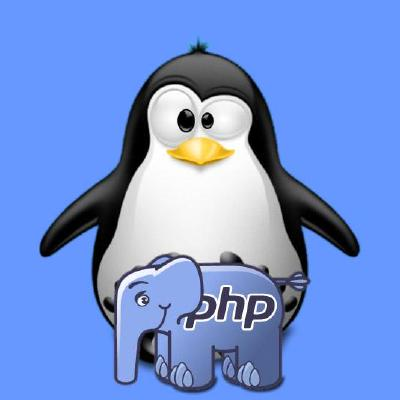

# Tools Library

Constitution d'une liste d'outils, répos, d'idées d'apps, challanges ou tout autre ressource pour s'améliorer en programmation peux importe son niveau

## Contributeurs

## App Ideas

[florinpop17/app-ideas](https://github.com/florinpop17/app-ideas/)

| Niveau                       | Profile développeur                                                                                                                                                |
| ---------------------------- | ------------------------------------------------------------------------------------------------------------------------------------------------------------------ |
| 1 | Développeurs aux premiers stades de leur parcours d’apprentissage. Ceux qui se concentrent généralement sur la création d’applications destinées aux utilisateurs. |
| 2 | Développeurs à un stade intermédiaire d’apprentissage et d’expérience. Ils sont à l’aise avec l’UI/UX, utilisent des outils de développement et créent des applications qui utilisent les services API. |
| 3 | Développeurs qui possèdent tout ce qui précède et apprennent des techniques plus avancées telles que la mise en œuvre d'applications backend et de services de base de données. |

### [Niveau 1 - Projets de niveau débutant](#niveau-1)

| Nom de projet                                                                                                                      | Courte déscription                            |
| ---------------------------------------------------------------------------------------------------------------------------------- | --------------------------------------------- |
| [Bin2Dec](https://github.com/florinpop17/app-ideas/blob/master/Projects/1-Beginner/Bin2Dec-App.md)                                 | Convertisseur de nombres binaires en décimaux |
| [Visionneur de border-radius](https://github.com/florinpop17/app-ideas/blob/master/Projects/1-Beginner/Border-Radius-Previewer.md) | Aperçu de la façon dont les valeurs de border-radius CSS3 affectent un élément |
| [Calculatrice](https://github.com/florinpop17/app-ideas/blob/master/Projects/1-Beginner/Calculator-App.md)                         | Calculatrice                                  |
| [Lumières de Noël](https://github.com/florinpop17/app-ideas/blob/master/Projects/1-Beginner/Christmas-Lights-App.md)               | Simulez une chaîne de lumières de Noël        |
| [Application Cause Effet](https://github.com/florinpop17/app-ideas/blob/master/Projects/1-Beginner/Christmas-Lights-App.md)        | Cliquez sur l'élément de la liste pour afficher les détails de l'élément        |
| [Cycle de couleurs](https://github.com/florinpop17/app-ideas/blob/master/Projects/1-Beginner/Color-Cycle-App.md)                   | Faire défiler une valeur de couleur à travers des changements incrémentiels        |
| [Compte à rebours](https://github.com/florinpop17/app-ideas/blob/master/Projects/1-Beginner/Countdown-Timer-App.md)                | Compte à rebours d'événement                  |
| [Application CSV2JSON](https://github.com/florinpop17/app-ideas/blob/master/Projects/1-Beginner/CSV2JSON-App.md)                   | Convertisseur CSV en JSON                     |
| [Dollars en Cents](https://github.com/florinpop17/app-ideas/blob/master/Projects/1-Beginner/Dollars-To-Cents-App.md)               | Convertir des dollars en centimes             |
| [Variables CSS dynamiques](https://github.com/florinpop17/app-ideas/blob/master/Projects/1-Beginner/Dynamic-CSSVar-app.md)         | Modifier dynamiquement les paramètres des variables CSS |
| [Première application de base de données](https://github.com/florinpop17/app-ideas/blob/master/Projects/1-Beginner/First-DB-App.md) | Votre première application de base de données ! |
| [Retourner l'image](https://github.com/florinpop17/app-ideas/blob/master/Projects/1-Beginner/Flip-Image-App.md)                    | Changer l'orientation des images sur deux axes |
| Le reste arrive plus tards                                                                                                         | ...                                           |

### [Niveau 2 - Projets de niveau intermédière](#niveau-2)

| Nom de projet                                                                                                                      | Courte déscription                            |
| ---------------------------------------------------------------------------------------------------------------------------------- | --------------------------------------------- |
| Arrive plus tards                                                                                                                  | ...                                           |

### [Niveau 3 - Projets de niveau avancé](#niveau-3)

| Nom de projet                                                                                                                      | Courte déscription                            |
| ---------------------------------------------------------------------------------------------------------------------------------- | --------------------------------------------- |
| Arrive plus tards                                                                                                                  | ...                                           |

## Veille

### Les APIs
- [rest-api-guidelines.pdf](./assets/rest-api-guidelines.pdf)

### JavaScript
- [Les Promises](https://www.lydiahallie.com/blog/promise-execution?ref=dailydev)

---
 
> PS : C'est publique et ouvert à tous donc n'hésitez pas à faire une MR si vous avez d'autre sites de veille, outils, idées d'app à dev pour les devs juniors ou juste pour apprendre un langage, liens de tutos d'outils à dev sois même dans différents languages, ou même des liens vers des challanges de prog peux importe le langage ça interessera toujours des personnes si bien évidement ils ne sont pas déja présent ici 😉

## Autres liens prévus à rajouter
- https://github.com/tastejs/awesome-app-ideas
- https://github.com/codecrafters-io/build-your-own-x?tab=readme-ov-file
- https://github.com/osynavets/build-your-own-x-in-rust
- https://github.com/buhe/build-your-own-x-zh
- https://github.com/akondas/build-your-own-x-in-php
- https://tsch.js.org/
  - https://github.com/type-challenges/type-challenges
- https://dev.to/realflowcontrol/processing-one-billion-rows-in-php-3eg0
  - https://github.com/gunnarmorling/1brc?tab=readme-ov-file
  - https://www.morling.dev/blog/one-billion-row-challenge
